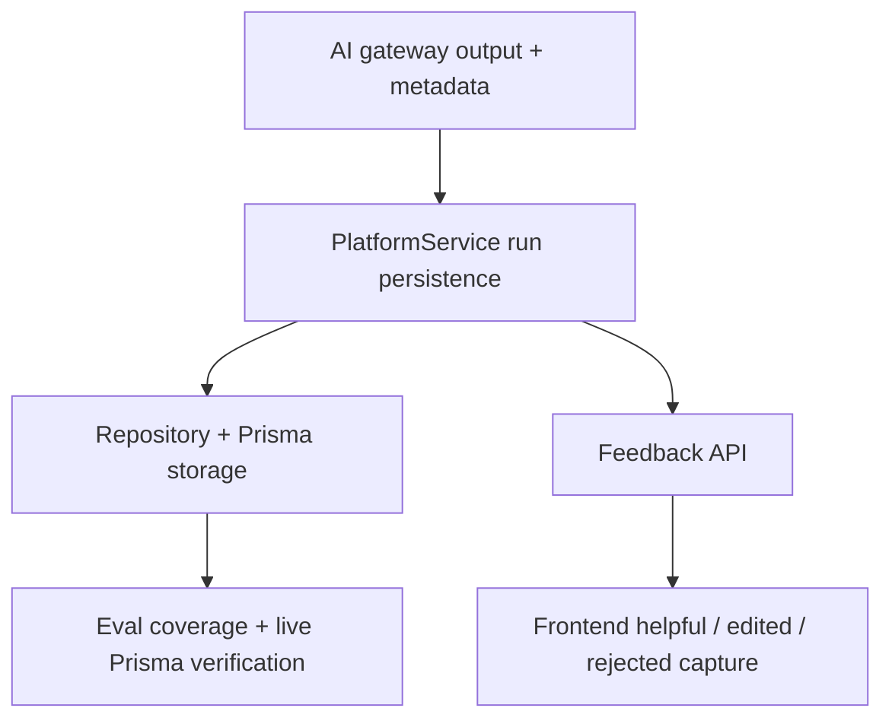

# AI Endpoint Hardening

This note tracks the production-grade hardening work for MentorMe AI endpoints.

## Dependency Graph

## Task Traceability

| Task | Depends on | Files |
| --- | --- | --- |
| Attach confidence, abstain, prompt version, retries, fallback metadata | None | `backend/src/ai/meta.ts`, `backend/src/ai/heuristicAiGateway.ts`, `backend/src/ai/openAiGateway.ts`, `backend/src/ai/runtime.ts` |
| Persist AI runs and feedback | Gateway metadata | `backend/src/domain/platformService.ts`, `backend/src/domain/interfaces.ts`, `backend/src/domain/types.ts`, `backend/src/infra/inMemoryRepository.ts`, `backend/src/infra/prismaRepository.ts`, `backend/prisma/schema.prisma`, `backend/prisma/seedData.ts` |
| Expose AI feedback API | Persisted runs | `backend/src/app.ts`, `backend/src/app.test.ts` |
| Capture accepted, edited, rejected feedback in product UI | Feedback API | `src/context/AppState.jsx`, `src/context/AppState.test.jsx`, `src/pages/StudentDashboard.jsx`, `src/pages/StudentWorkspace.jsx` |
| Expand evaluation and regression coverage | All of the above | `backend/evals/cases.ts`, `backend/src/ai/evals.test.ts`, `backend/scripts/prisma-e2e.ts` |

## Success Criteria

- Every AI endpoint returns structured output plus a persisted AI run record.
- AI runs store provider, requested provider, prompt version, confidence, abstain signal, token usage, retry count, and fallback status.
- Users can record `helpful` / `not_helpful` with `accepted` / `edited` / `rejected` outcomes.
- Edited outputs are stored for future benchmark comparison.
- Eval coverage includes easy, edge, and low-signal cases.
- Prisma smoke verifies AI run persistence end to end.
