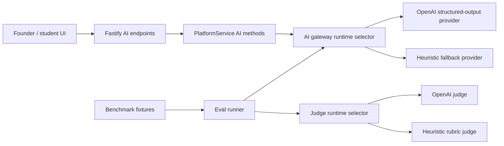
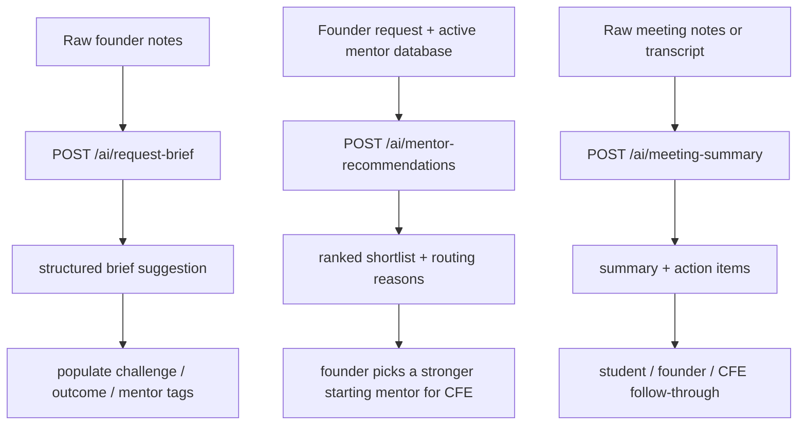

# AI Endpoints And Evals

Date: `2026-04-09`

This document defines the AI layer requested for the next review:

- `POST /ai/request-brief`
- `POST /ai/mentor-recommendations`
- `POST /ai/meeting-summary`
- an evaluation benchmark with sample cases
- an LLM-as-judge path for quality checks whenever the model changes
- deployment-ready configuration notes for the AI-enabled stack

## Goal

MentorMe already has the non-AI operating workflow. The AI layer now helps at three high-leverage points:

1. turning rough founder notes into a cleaner mentor-ready request brief
2. ranking mentors strictly from the active mentor database for a given founder request
3. turning raw meeting notes into structured follow-through tasks

## Architecture



## Endpoint Flow



## Task List With Traceability

| Task ID | Task | Why it exists | Primary surfaces |
| --- | --- | --- | --- |
| AI1 | Add runtime-selectable AI provider contract | Keep the app deployable with real AI and testable offline | `backend/src/domain/interfaces.ts`, `backend/src/ai/*`, `backend/src/server.ts` |
| AI2 | Implement request-brief endpoint | Help founders shape rough notes into a stronger CFE-ready brief | `backend/src/app.ts`, `backend/src/domain/platformService.ts` |
| AI3 | Implement mentor-recommendation endpoint | Rank only the mentors already present in the database and explain why they fit | `backend/src/app.ts`, `backend/src/domain/platformService.ts`, `src/pages/StudentDashboard.jsx` |
| AI4 | Implement meeting-summary endpoint | Help students convert messy notes into concrete follow-through | `backend/src/app.ts`, `backend/src/domain/platformService.ts` |
| AI5 | Cover AI endpoints with tests | Prevent regressions in contract, validation, and provider wiring | `backend/src/app.test.ts`, `src/context/AppState.test.jsx` |
| AI6 | Add benchmark fixtures and eval runner | Compare models safely when the AI provider changes | `backend/evals/*`, `backend/src/ai/evals.ts`, `backend/scripts/run-ai-evals.ts` |
| AI7 | Expose AI helpers in the UI | Make the AI layer demoable in the product, not just Swagger | `src/context/AppState.jsx`, `src/pages/StudentDashboard.jsx`, `src/pages/StudentWorkspace.jsx` |
| AI8 | Document deployment and credential requirements | Make the AI-enabled stack runnable beyond local demo mode | `README.md`, `.env.example`, `docs/ai-endpoints-and-evals.md` |

## Runtime Strategy

- `AI_PROVIDER=auto`: prefer OpenAI when `OPENAI_API_KEY` exists, otherwise use the heuristic fallback
- `AI_PROVIDER=openai`: require OpenAI and fail fast if credentials are missing
- `AI_PROVIDER=heuristic`: force local deterministic behavior for demos and tests

The same pattern applies to the judge path:

- `AI_JUDGE_PROVIDER=auto`
- `AI_JUDGE_PROVIDER=openai`
- `AI_JUDGE_PROVIDER=heuristic`

## Commands

Local development:

```bash
npm run dev:full
```

AI benchmark:

```bash
npm run eval:ai
```

Production-style startup:

```bash
npm run build
npm run start:api
npm run start:worker
```

## Benchmark Design

- Benchmark fixtures live in `backend/evals/cases.ts`
- `backend/scripts/run-ai-evals.ts` runs all three AI tasks across those cases
- the report includes per-case pass/fail plus average score
- the current benchmark pack covers `6` cases total across the three AI endpoints
- the judge path uses:
  - OpenAI structured outputs when `AI_JUDGE_PROVIDER=openai` or `auto` with a valid key
  - the built-in heuristic judge otherwise

This gives the project a benchmark that works offline for local verification and an LLM-as-judge path for real model-comparison reviews.

## Deployment Checklist

1. Deploy the frontend with `npm run build` and set `VITE_API_BASE_URL` to the API host.
2. Deploy the Fastify API with `npm run start:api`.
3. Deploy the worker with `npm run start:worker`.
4. Use `GET /healthz` as the API liveness probe.
5. Provision PostgreSQL and set `DATABASE_URL`.
6. Set auth secrets and cookie secret.
7. Set `AI_PROVIDER`, `AI_JUDGE_PROVIDER`, and `OPENAI_API_KEY` if you want the OpenAI-backed AI path.
8. Run `npm run eval:ai` against the chosen model configuration before promoting it.
9. If you want an in-repo deploy manifest, use the tracked `render.yaml` blueprint.

## Honest Scope Boundary

- The AI endpoints are fully implemented and callable from the API and product UI.
- The eval benchmark is fully implemented, with sample cases and an LLM-judge path.
- Running the OpenAI-backed path still depends on external credentials.
- Actual internet deployment still depends on platform credentials that are not stored in the repo.
