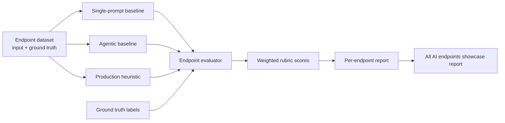

# AI Endpoints Showcase Report

Date: `2026-05-08`

Endpoints covered:

- `POST /ai/request-brief`
- `POST /ai/meeting-summary`
- `POST /ai/mentor-recommendations`

## Status

All three MentorMe AI endpoints now have the required showcase package:

- dataset with endpoint-shaped input and ground truth
- deterministic evaluation implementation
- baseline single LLM prompt
- agentic baseline
- current production heuristic comparison
- runnable CLI command and tests

This report supersedes the earlier request-brief-only report at `docs/request-brief-ai-showcase-report.md`.

## File Map

| File | Purpose |
| --- | --- |
| `backend/evals/requestBriefShowcaseDataset.ts` | Request-brief dataset with `3` inputs and ground truth labels. |
| `backend/evals/meetingSummaryShowcaseDataset.ts` | Meeting-summary dataset with `3` inputs and ground truth labels. |
| `backend/evals/mentorRecommendationShowcaseDataset.ts` | Mentor-recommendations dataset with `3` inputs and ground truth labels. |
| `backend/src/ai/showcaseScoring.ts` | Shared theme matching, coverage scoring, and weighted rubric scoring helpers. |
| `backend/src/ai/requestBriefShowcase.ts` | Request-brief baselines, evaluator, and report runner. |
| `backend/src/ai/meetingSummaryShowcase.ts` | Meeting-summary baselines, evaluator, and report runner. |
| `backend/src/ai/mentorRecommendationShowcase.ts` | Mentor-recommendations baselines, evaluator, and report runner. |
| `backend/src/ai/aiEndpointShowcase.ts` | Aggregates all three endpoint showcase reports. |
| `backend/src/ai/evals.ts` | Supports heuristic or OpenAI generation, live OpenAI judging, and optional case throttling for low-RPM accounts. |
| `backend/scripts/run-ai-evals.ts` | Reads `AI_EVAL_START_DELAY_MS` and `AI_EVAL_CASE_DELAY_MS` for live judge runs. |
| `backend/scripts/run-request-brief-showcase.ts` | CLI runner for request brief showcase. |
| `backend/scripts/run-meeting-summary-showcase.ts` | CLI runner for meeting summary showcase. |
| `backend/scripts/run-mentor-recommendation-showcase.ts` | CLI runner for mentor recommendations showcase. |
| `backend/scripts/run-ai-endpoint-showcases.ts` | CLI runner for all AI endpoint showcases. |
| `backend/src/ai/*Showcase.test.ts` | Regression tests for dataset shape, baselines, evaluators, and runner behavior. |
| `package.json` | Adds `npm run eval:ai:showcases` and individual showcase scripts. |

## Evaluation Flow



## 3.1 Datasets With Input And Ground Truth

Total showcase dataset size: `9` cases.

| Endpoint | Dataset File | Cases | Ground Truth Captures |
| --- | --- | ---: | --- |
| `POST /ai/request-brief` | `backend/evals/requestBriefShowcaseDataset.ts` | 3 | challenge themes, desired outcome themes, mentor tags, readiness signals, missing info, routing decision. |
| `POST /ai/meeting-summary` | `backend/evals/meetingSummaryShowcaseDataset.ts` | 3 | summary themes, key takeaways, founder/student/CFE actions, follow-up questions, second-session decision. |
| `POST /ai/mentor-recommendations` | `backend/evals/mentorRecommendationShowcaseDataset.ts` | 3 | expected top mentor order, forbidden mentors, required search tags, reason themes, routing-note themes. |

## 3.2 Evaluation Implementation

Evaluation is implemented as deterministic execution-in-loop scoring. It does not need a network call, which keeps CI and local demos stable.

The shared evaluator helpers live in `backend/src/ai/showcaseScoring.ts`.

Endpoint-specific evaluator files:

- `backend/src/ai/requestBriefShowcase.ts`
- `backend/src/ai/meetingSummaryShowcase.ts`
- `backend/src/ai/mentorRecommendationShowcase.ts`

Rubric summary:

| Endpoint | Rubric Checks |
| --- | --- |
| Request brief | schema contract, challenge grounding, outcome grounding, mentor-fit tags, readiness signals, missing information, CFE routing note. |
| Meeting summary | schema contract, executive summary grounding, key takeaways, founder actions, student actions, CFE actions, follow-up questions, second-session decision. |
| Mentor recommendations | schema contract, search-tag grounding, shortlist order, reason grounding, irrelevant mentor exclusion, routing-note grounding. |

Passing threshold: `overallScore >= 3.5` and valid schema.

## 3.3 Baselines

Each endpoint now has three compared implementations:

| Baseline | Meaning |
| --- | --- |
| `single_prompt_baseline` | A simple one-shot prompt baseline with local deterministic behavior that simulates a basic LLM prompt. |
| `agentic_baseline` | A staged baseline that parses context, checks gaps, critiques the draft/ranking, and then emits endpoint JSON. |
| `production_heuristic_current` | Current local fallback from `HeuristicAiGateway`, used for comparison with deployed non-OpenAI behavior. |

Prompt and plan exports:

| Endpoint | Single Prompt Export | Agentic Plan Export |
| --- | --- | --- |
| Request brief | `singlePromptRequestBriefBaselinePrompt` | `agenticRequestBriefBaselinePlan` |
| Meeting summary | `singlePromptMeetingSummaryBaselinePrompt` | `agenticMeetingSummaryBaselinePlan` |
| Mentor recommendations | `singlePromptMentorRecommendationBaselinePrompt` | `agenticMentorRecommendationBaselinePlan` |

## Commands

Run all AI endpoint showcases:

```bash
npm run eval:ai:showcases
```

Run one endpoint showcase:

```bash
npm run eval:ai:request-brief-showcase
npm run eval:ai:meeting-summary-showcase
npm run eval:ai:mentor-recommendations-showcase
```

## Showcase Results

Successful all-endpoints command:

```bash
npm run eval:ai:showcases
```

Summary:

| Endpoint | Dataset Cases | Evaluated Outputs |
| --- | ---: | ---: |
| `POST /ai/request-brief` | 3 | 9 |
| `POST /ai/meeting-summary` | 3 | 9 |
| `POST /ai/mentor-recommendations` | 3 | 9 |
| Total | 9 | 27 |

Baseline scores:

| Endpoint | Baseline | Cases | Passed | Average Score |
| --- | --- | ---: | ---: | ---: |
| `POST /ai/request-brief` | `single_prompt_baseline` | 3 | 3 | 3.96 |
| `POST /ai/request-brief` | `agentic_baseline` | 3 | 3 | 4.34 |
| `POST /ai/request-brief` | `production_heuristic_current` | 3 | 3 | 4.02 |
| `POST /ai/meeting-summary` | `single_prompt_baseline` | 3 | 3 | 4.83 |
| `POST /ai/meeting-summary` | `agentic_baseline` | 3 | 3 | 4.50 |
| `POST /ai/meeting-summary` | `production_heuristic_current` | 3 | 3 | 4.50 |
| `POST /ai/mentor-recommendations` | `single_prompt_baseline` | 3 | 3 | 4.37 |
| `POST /ai/mentor-recommendations` | `agentic_baseline` | 3 | 3 | 4.37 |
| `POST /ai/mentor-recommendations` | `production_heuristic_current` | 3 | 3 | 4.31 |

## Live OpenAI Judge Result

The live OpenAI path was run after the deterministic showcase. This was not simulated:

- generation provider: `openai`
- judge provider: `openai`
- generator model: `gpt-5-mini`
- judge model: `gpt-5-mini`
- throttle: `45s` startup delay and `65s` between cases, because the account was limited to `3` requests per minute

Command shape, with the key redacted:

```bash
OPENAI_API_KEY=<redacted> \
AI_PROVIDER=openai \
AI_JUDGE_PROVIDER=openai \
OPENAI_MODEL=gpt-5-mini \
OPENAI_JUDGE_MODEL=gpt-5-mini \
OPENAI_TIMEOUT_MS=90000 \
OPENAI_MAX_ATTEMPTS=1 \
AI_EVAL_START_DELAY_MS=45000 \
AI_EVAL_CASE_DELAY_MS=65000 \
npm run eval:ai
```

Result:

| Metric | Value |
| --- | ---: |
| Total eval cases | 6 |
| Passed | 6 |
| Average score | 4.75 |
| Model provider | `openai` |
| Judge provider | `openai` |

Live judge case scores:

| Case | Task | Score | Pass |
| --- | --- | ---: | --- |
| `brief-ecodrone-fundraising` | `request_brief` | 5.0 | yes |
| `brief-healthsathi-regulatory` | `request_brief` | 5.0 | yes |
| `meeting-ecodrone-followup` | `meeting_summary` | 5.0 | yes |
| `meeting-healthsathi-regulatory` | `meeting_summary` | 5.0 | yes |
| `mentor-ecodrone-fundraising` | `mentor_recommendation` | 4.0 | yes |
| `mentor-healthsathi-regulatory` | `mentor_recommendation` | 4.5 | yes |

## Verification

Commands run so far:

```bash
npx vitest run backend/src/ai/requestBriefShowcase.test.ts backend/src/ai/meetingSummaryShowcase.test.ts backend/src/ai/mentorRecommendationShowcase.test.ts backend/src/ai/aiEndpointShowcase.test.ts
npx vitest run backend/src/ai/evals.test.ts
npm run eval:ai:showcases
env AI_PROVIDER=heuristic AI_JUDGE_PROVIDER=heuristic npm run eval:ai
OPENAI_API_KEY=<redacted> AI_PROVIDER=openai AI_JUDGE_PROVIDER=openai OPENAI_MODEL=gpt-5-mini OPENAI_JUDGE_MODEL=gpt-5-mini OPENAI_TIMEOUT_MS=90000 OPENAI_MAX_ATTEMPTS=1 AI_EVAL_START_DELAY_MS=45000 AI_EVAL_CASE_DELAY_MS=65000 npm run eval:ai
npm run lint
npx tsc --noEmit
npm test
npm run build
git diff --check
```

Final results:

- Focused showcase tests: `4` test files passed, `13` tests passed.
- Focused eval runner tests: `1` test file passed, `2` tests passed.
- `npm run eval:ai:showcases`: passed with `9` dataset cases and `27` evaluated outputs.
- `env AI_PROVIDER=heuristic AI_JUDGE_PROVIDER=heuristic npm run eval:ai`: `6/6` eval cases passed, average score `4.05`.
- Live OpenAI generation and live OpenAI judge run: `6/6` eval cases passed, average score `4.75`.
- `npm run lint`: passed.
- `npx tsc --noEmit`: passed.
- `npm test`: `32` test files passed, `176` tests passed.
- `npm run build`: passed. Vite still reports the existing chunk-size warning for a bundle over `500 kB`.
- `git diff --check`: passed.

## Notes On API Key Handling

No API key is stored in the repository.

The deterministic showcase can run without external credentials. The live OpenAI judge run used `OPENAI_API_KEY` only as a shell environment variable with the value redacted from this report.

## Requirement Status

| Requirement | Status |
| --- | --- |
| Dataset with input and ground truth for `POST /ai/request-brief` | Complete |
| Dataset with input and ground truth for `POST /ai/meeting-summary` | Complete |
| Dataset with input and ground truth for `POST /ai/mentor-recommendations` | Complete |
| Evaluation implementation for all three AI endpoints | Complete |
| Single LLM prompt baseline for all three AI endpoints | Complete |
| Agentic baseline for all three AI endpoints | Complete |
| Live OpenAI generation and live OpenAI judge run | Complete |
| Markdown status report | Complete |
