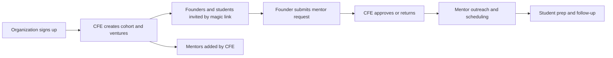
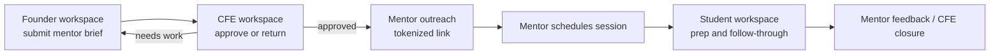
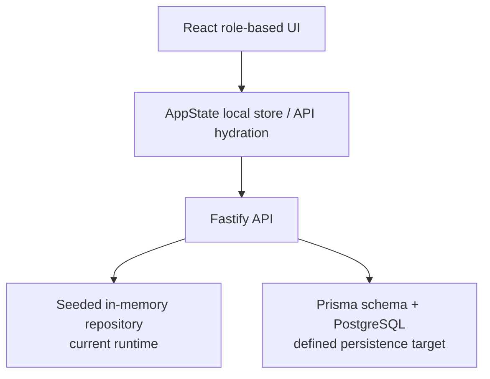

# MentorMe Code Review Readiness

This document is the review packet for the code review scheduled on **March 8, 2026**. It covers the requested items:

1. product pitch and onboarding
2. user journeys for every role
3. databases/data model required by those screens
4. API endpoints involved
5. where each part lives in the codebase

## Review Checklist With Traceability

| Review ask | Covered in this doc | Source of truth in code |
| --- | --- | --- |
| Product pitch and onboarding | Sections 1 and 2 | [README.md](/Users/owlxshri/Desktop/MentorMe/README.md), [src/pages/RoleHome.jsx](/Users/owlxshri/Desktop/MentorMe/src/pages/RoleHome.jsx) |
| User journeys for all users | Section 3 | [src/pages/StudentDashboard.jsx](/Users/owlxshri/Desktop/MentorMe/src/pages/StudentDashboard.jsx), [src/pages/StudentWorkspace.jsx](/Users/owlxshri/Desktop/MentorMe/src/pages/StudentWorkspace.jsx), [src/pages/AdminDashboard.jsx](/Users/owlxshri/Desktop/MentorMe/src/pages/AdminDashboard.jsx), [src/pages/MentorPortfolio.jsx](/Users/owlxshri/Desktop/MentorMe/src/pages/MentorPortfolio.jsx) |
| Databases in use | Section 4 | [src/context/AppState.jsx](/Users/owlxshri/Desktop/MentorMe/src/context/AppState.jsx), [backend/src/server.ts](/Users/owlxshri/Desktop/MentorMe/backend/src/server.ts), [backend/prisma/schema.prisma](/Users/owlxshri/Desktop/MentorMe/backend/prisma/schema.prisma) |
| API endpoints involved | Section 5 | [backend/src/app.ts](/Users/owlxshri/Desktop/MentorMe/backend/src/app.ts), [backend/src/domain/platformService.ts](/Users/owlxshri/Desktop/MentorMe/backend/src/domain/platformService.ts) |
| Code understanding and ownership | Section 6 | [src/App.jsx](/Users/owlxshri/Desktop/MentorMe/src/App.jsx), [backend/src/app.test.ts](/Users/owlxshri/Desktop/MentorMe/backend/src/app.test.ts), [src/App.test.jsx](/Users/owlxshri/Desktop/MentorMe/src/App.test.jsx) |

## 1. Product Pitch

### Product

MentorMe is a **CFE-operated mentor access and venture readiness platform** for incubators, entrepreneurship cells, and university startup programs.

It is not a public mentor marketplace. It is a **controlled workflow** where:

- founders submit a structured mentor ask
- CFE checks readiness, fit, and mentor bandwidth
- students handle prep and follow-through
- mentors receive filtered, high-context requests instead of random outreach

### Core problem

Today, mentor operations are usually scattered across:

- spreadsheets
- WhatsApp groups
- email threads
- ad hoc founder introductions
- follow-up notes that live in personal documents

That creates predictable failures:

- founders ask for mentor time too early
- mentors receive low-context requests
- CFE cannot track who approved what
- meeting prep and follow-up are inconsistent
- mentor utilization is invisible

### Solution

MentorMe gives the program a single operating layer for:

- venture and readiness context
- founder mentor request intake
- CFE approval and return loop
- mentor network capacity and visibility control
- scheduling, feedback, and post-meeting follow-through

### One-line pitch for review

**MentorMe is the operating system for mentor access inside an incubator: founders ask, CFE triages, students prepare, mentors respond, and every interaction stays measurable.**

## 2. Onboarding Model

### Organization onboarding

1. CFE creates the organization and cohort.
2. CFE creates or imports ventures.
3. CFE invites founders and student members to each venture.
4. CFE creates mentor profiles with focus, stages, tolerance, and monthly capacity.
5. CFE starts operating mentor access through the platform instead of direct introductions.

### User onboarding

| User | How they onboard | Current implementation status |
| --- | --- | --- |
| Founder | Receives magic link, enters venture workspace, submits mentor asks | Implemented in backend auth flow and founder workspace |
| Student | Receives magic link, enters student workspace, tracks prep and follow-up | Implemented in backend auth flow and student workspace |
| CFE | Receives magic link or admin-created account, opens control workspace | Implemented in backend auth flow and CFE workspace |
| Mentor | Receives secure tokenized email link for specific request actions | Partially implemented: schedule and feedback exist, respond endpoint is still `501` |

## 3. User Journeys

### End-to-end flow

### Task list and screen traceability

| Task | Primary screen | Why that screen exists | Current semester status |
| --- | --- | --- | --- |
| Pick role-specific entry point | `/` | Avoid one overloaded dashboard for all personas | Implemented |
| Founder submits mentor request | `/founders` | Capture challenge, desired outcome, artifacts, and mentor preference | Implemented |
| Student prepares and follows through | `/students` | Keep prep checklist and action nudges in one place | Implemented |
| CFE reviews and routes requests | `/cfe` | Approve, return, and monitor the request pipeline | Implemented |
| CFE manages mentor capacity | `/cfe/network` | Control visibility, tolerance, and monthly capacity | Implemented |
| Readiness playbook reference | `/playbook` | Explain TRL and BRL for routing decisions | Implemented |
| Mentor self-serve accept/decline | external secure link | Reduce CFE coordination effort | Not implemented yet |

### Founder journey

**Who is this user**  
A startup founder asking for strategic, technical, GTM, fundraising, or domain-specific mentor help.

**Why they log in**  
To submit a structured request, attach context, and track whether CFE approved, returned, or scheduled the request.

**How they use the system now**

- open `/founders`
- review venture summary and TRL/BRL
- write the challenge and desired outcome
- attach artifact references
- shortlist a preferred mentor
- send the request to CFE review
- monitor status changes and mentor notes

**How they were doing this earlier**

- asking program staff on chat
- sending partial decks over email
- relying on informal introductions
- losing visibility after the first intro

**Relevant code**

- [src/pages/StudentDashboard.jsx](/Users/owlxshri/Desktop/MentorMe/src/pages/StudentDashboard.jsx)
- [src/context/AppState.jsx](/Users/owlxshri/Desktop/MentorMe/src/context/AppState.jsx)

### Student journey

**Who is this user**  
A student operator, intern, or venture support member helping the startup prepare and document mentor sessions.

**Why they log in**  
To avoid missed meetings, organize materials, and record follow-up after the session.

**How they use the system now**

- open `/students`
- review current venture and readiness context
- open the prep checklist
- watch action nudges for scheduled, returned, or follow-up requests
- use the playbook for TRL/BRL guidance

**How they were doing this earlier**

- personal notes
- shared docs
- calendar reminders
- manual follow-up through chat

**Relevant code**

- [src/pages/StudentWorkspace.jsx](/Users/owlxshri/Desktop/MentorMe/src/pages/StudentWorkspace.jsx)

### CFE journey

**Who is this user**  
Program operations staff who control mentor access and protect mentor bandwidth.

**Why they log in**  
To approve only strong asks, return weak requests, monitor the pipeline, and manage mentor network capacity.

**How they use the system now**

- open `/cfe`
- review requests in `cfe_review`
- approve or return requests
- monitor `scheduled`, `needs_work`, and `follow_up`
- open `/cfe/network`
- create mentor profiles
- pause mentor visibility or adjust monthly capacity

**How they were doing this earlier**

- spreadsheet-based mentor tracking
- memory-based matching
- forwarding decks manually
- chasing founders after meetings

**Relevant code**

- [src/pages/AdminDashboard.jsx](/Users/owlxshri/Desktop/MentorMe/src/pages/AdminDashboard.jsx)
- [src/pages/MentorPortfolio.jsx](/Users/owlxshri/Desktop/MentorMe/src/pages/MentorPortfolio.jsx)
- [src/components/KanbanBoard.jsx](/Users/owlxshri/Desktop/MentorMe/src/components/KanbanBoard.jsx)

### Mentor journey

**Who is this user**  
An external mentor who should get only curated and high-context requests.

**Why they interact with the system**  
To receive a filtered request, schedule the session, and send structured feedback without joining the full internal product.

**How they use the system now**

- receive tokenized outreach email
- open secure mentor action link
- schedule a meeting
- submit structured feedback

**How they were doing this earlier**

- email back-and-forth with CFE
- forwarded decks
- informal feedback after calls

**Current status**

- secure outreach token: implemented
- schedule endpoint: implemented
- feedback endpoint: implemented
- accept/decline response step: not implemented yet

**Relevant code**

- [backend/src/domain/platformService.ts](/Users/owlxshri/Desktop/MentorMe/backend/src/domain/platformService.ts)
- [backend/src/app.ts](/Users/owlxshri/Desktop/MentorMe/backend/src/app.ts)

## 4. Databases and Data Model

### Honest current state

There are **three data layers** in the repo today, and they should be described distinctly during review:

| Layer | What it is used for | Actual status |
| --- | --- | --- |
| Frontend in-memory state | Local/demo UI state management | Implemented in [src/context/AppState.jsx](/Users/owlxshri/Desktop/MentorMe/src/context/AppState.jsx) |
| Backend seeded in-memory repository | Default runtime repository used by the Fastify server | Implemented in [backend/src/server.ts](/Users/owlxshri/Desktop/MentorMe/backend/src/server.ts) |
| PostgreSQL via Prisma | Persistent production-grade schema and seed model | Defined in [backend/prisma/schema.prisma](/Users/owlxshri/Desktop/MentorMe/backend/prisma/schema.prisma), not yet wired as the runtime repository |

So the correct answer is:

- **current running demo uses in-memory state/repository**
- **the defined persistent database is PostgreSQL with Prisma**

### Architecture view

### Core tables/entities required by the screens

| Screen / flow | Reads | Writes | Why it exists |
| --- | --- | --- | --- |
| Role home | none beyond route metadata | none | Entry point into role-based UX |
| Founder workspace | `Venture`, `MentorProfile`, `MentorRequest` | `MentorRequest`, `MentorRequestShortlist` | Founder creates a request with context and mentor preference |
| Student workspace | `Venture`, `MentorRequest` | eventually `Artifact`, follow-up state | Student needs prep and follow-through context |
| CFE dashboard | `MentorRequest`, `MentorProfile` | request status changes, CFE ownership | CFE triages and routes requests |
| Mentor network | `MentorProfile`, request load view | `MentorProfile`, `MentorCapacitySnapshot` | CFE manages capacity and visibility |
| Artifact upload flow | `MentorRequest` | `Artifact` | Founder/student uploads documents |
| Mentor schedule flow | `ExternalActionToken`, `MentorRequest` | `Meeting`, request status | Mentor schedules a session from secure link |
| Mentor feedback flow | `ExternalActionToken`, `Meeting` | `MeetingFeedback`, request status | Capture meeting outcome and next-step signal |
| Auth flow | `User`, `MagicLinkToken`, `Session` | same | Passwordless onboarding and session management |
| Notifications / async ops | `Notification`, `ScheduledNudge`, `AuditEvent`, `WebhookReceipt`, `OutboxEvent` | same | Reliability, nudges, audits, and webhook idempotency |

### Entity groups in Prisma

- **Org and access**
  - `Organization`
  - `Cohort`
  - `User`
  - `Venture`
  - `VentureMembership`

- **Mentor network**
  - `MentorProfile`
  - `MentorCapacitySnapshot`

- **Mentor workflow**
  - `MentorRequest`
  - `MentorRequestShortlist`
  - `Artifact`
  - `Meeting`
  - `MeetingFeedback`

- **Authentication and external links**
  - `MagicLinkToken`
  - `Session`
  - `ExternalActionToken`

- **Ops and observability**
  - `Notification`
  - `ScheduledNudge`
  - `AuditEvent`
  - `WebhookReceipt`
  - `OutboxEvent`

### Source of truth

- schema: [backend/prisma/schema.prisma](/Users/owlxshri/Desktop/MentorMe/backend/prisma/schema.prisma)
- types: [backend/src/domain/types.ts](/Users/owlxshri/Desktop/MentorMe/backend/src/domain/types.ts)
- runtime repo wiring: [backend/src/server.ts](/Users/owlxshri/Desktop/MentorMe/backend/src/server.ts)

## 5. API Endpoints Involved

### Implemented API surface

| Area | Endpoint | Purpose | Status |
| --- | --- | --- | --- |
| Auth | `POST /auth/magic-link/request` | request passwordless login link | Implemented |
| Auth | `POST /auth/magic-link/verify` | verify link and issue tokens | Implemented |
| Auth | `POST /auth/refresh` | refresh access token | Implemented |
| Auth | `POST /auth/logout` | clear refresh token | Implemented |
| Auth | `GET /me` | current authenticated user | Implemented |
| Venture data | `GET /ventures` | list ventures visible to user | Implemented |
| Venture data | `GET /ventures/:ventureId` | fetch one venture | Implemented |
| Request data | `GET /requests` | list requests visible to user | Implemented |
| Request data | `GET /ventures/:ventureId/requests` | list requests for one venture | Implemented |
| Founder request flow | `POST /ventures/:ventureId/requests` | create mentor request | Implemented |
| Founder request flow | `POST /requests/:requestId/submit` | legacy submit path | Exists but returns `501` |
| CFE workflow | `POST /requests/:requestId/return` | return request for revision | Implemented |
| CFE workflow | `POST /requests/:requestId/approve` | approve request for mentor routing | Implemented |
| CFE workflow | `POST /requests/:requestId/close` | close completed request | Implemented |
| Artifacts | `POST /requests/:requestId/artifacts/presign` | prepare upload | Implemented |
| Artifacts | `POST /requests/:requestId/artifacts/complete` | mark upload complete | Implemented |
| Mentor directory | `GET /mentors` | list mentors | Implemented |
| Mentor directory | `POST /mentors` | create mentor profile | Implemented |
| Mentor directory | `PATCH /mentors/:mentorId` | update mentor profile | Implemented |
| Mentor outreach | `POST /requests/:requestId/mentor-outreach` | create secure mentor action token | Implemented |
| Mentor actions | `POST /mentor-actions/:token/respond` | mentor accept/decline | Exists but returns `501` |
| Mentor actions | `POST /mentor-actions/:token/schedule` | mentor schedules session | Implemented |
| Mentor actions | `POST /mentor-actions/:token/feedback` | mentor submits feedback | Implemented |
| Webhooks | `POST /webhooks/calendly` | ingest Calendly webhook | Implemented |
| Live updates | `GET /notifications/stream` | SSE request update stream | Implemented |

### Endpoint mapping by user journey

| User journey step | Endpoints involved |
| --- | --- |
| Founder logs in | `POST /auth/magic-link/request`, `POST /auth/magic-link/verify`, `GET /me` |
| Founder loads workspace | `GET /ventures`, `GET /requests`, `GET /mentors` |
| Founder creates request | `POST /ventures/:ventureId/requests` |
| Founder uploads artifacts | `POST /requests/:requestId/artifacts/presign`, `POST /requests/:requestId/artifacts/complete` |
| CFE reviews queue | `GET /requests`, `GET /mentors` |
| CFE returns request | `POST /requests/:requestId/return` |
| CFE approves request | `POST /requests/:requestId/approve` |
| CFE manages mentor directory | `GET /mentors`, `POST /mentors`, `PATCH /mentors/:mentorId` |
| CFE initiates outreach | `POST /requests/:requestId/mentor-outreach` |
| Mentor schedules meeting | `POST /mentor-actions/:token/schedule` |
| Mentor gives feedback | `POST /mentor-actions/:token/feedback` |
| Calendly syncs schedule | `POST /webhooks/calendly` |
| Frontend receives live updates | `GET /notifications/stream` |

### Source of truth

- routes: [backend/src/app.ts](/Users/owlxshri/Desktop/MentorMe/backend/src/app.ts)
- business logic: [backend/src/domain/platformService.ts](/Users/owlxshri/Desktop/MentorMe/backend/src/domain/platformService.ts)

## 6. Code Understanding Map

### If asked “where is this implemented?”

| Concern | Main file |
| --- | --- |
| Route split by persona | [src/App.jsx](/Users/owlxshri/Desktop/MentorMe/src/App.jsx) |
| Role entry page | [src/pages/RoleHome.jsx](/Users/owlxshri/Desktop/MentorMe/src/pages/RoleHome.jsx) |
| Founder request UI | [src/pages/StudentDashboard.jsx](/Users/owlxshri/Desktop/MentorMe/src/pages/StudentDashboard.jsx) |
| Student prep UI | [src/pages/StudentWorkspace.jsx](/Users/owlxshri/Desktop/MentorMe/src/pages/StudentWorkspace.jsx) |
| CFE queue UI | [src/pages/AdminDashboard.jsx](/Users/owlxshri/Desktop/MentorMe/src/pages/AdminDashboard.jsx) |
| Mentor network UI | [src/pages/MentorPortfolio.jsx](/Users/owlxshri/Desktop/MentorMe/src/pages/MentorPortfolio.jsx) |
| Shared frontend state and backend hydration | [src/context/AppState.jsx](/Users/owlxshri/Desktop/MentorMe/src/context/AppState.jsx) |
| Seed/demo frontend data | [src/data/platformData.js](/Users/owlxshri/Desktop/MentorMe/src/data/platformData.js) |
| API route registration | [backend/src/app.ts](/Users/owlxshri/Desktop/MentorMe/backend/src/app.ts) |
| Workflow business rules | [backend/src/domain/platformService.ts](/Users/owlxshri/Desktop/MentorMe/backend/src/domain/platformService.ts) |
| Runtime backend wiring | [backend/src/server.ts](/Users/owlxshri/Desktop/MentorMe/backend/src/server.ts) |
| Persistent schema definition | [backend/prisma/schema.prisma](/Users/owlxshri/Desktop/MentorMe/backend/prisma/schema.prisma) |
| Backend workflow verification | [backend/src/app.test.ts](/Users/owlxshri/Desktop/MentorMe/backend/src/app.test.ts) |
| Frontend role-flow verification | [src/App.test.jsx](/Users/owlxshri/Desktop/MentorMe/src/App.test.jsx) |

### What is already tested

- frontend lands on role-specific home instead of a single overloaded dashboard
- founders can submit a request
- founders only see venture-scoped request data
- paused mentors disappear from founder matching
- CFE can return a request and founders can see the returned state
- backend auth flow works
- backend request creation works
- backend return and approve workflow works
- backend artifact upload presign/complete flow works
- backend mentor outreach, scheduling, and feedback flows work
- Calendly webhook idempotency is tested

## 7. Current Semester Scope vs Later Scope

### Defined and implemented now

- role-based frontend screens
- founder, student, and CFE workflows
- mentor directory management
- request lifecycle states
- Fastify REST API contract
- secure magic-link auth flow
- external mentor scheduling and feedback endpoints
- Prisma/PostgreSQL schema for production data model
- automated tests for core frontend and backend flows

### Defined now but not fully implemented yet

- runtime repository backed by Prisma/PostgreSQL instead of seeded in-memory data
- full mentor accept/decline endpoint
- production email provider
- production storage provider
- durable queue/worker infrastructure
- hardened webhook verification and deployment integrations

### Mid-sem review targets from here

- finalize product pitch
- release product trailer
- implement all non-AI endpoints
- implement at least one AI endpoint
- define AI evaluation strategy
- define benchmarking strategy

## 8. Honest Review Summary

The repo is already strong on **definition**:

- product pitch is clear
- user journeys are mapped to screens
- data model is defined
- API contract is implemented for the core workflow
- code ownership is easy to explain

The honest implementation answer for review should be:

- the **frontend workflows are implemented**
- the **backend contract is implemented and tested**
- the **persistent Prisma/PostgreSQL schema is defined**
- the **default runtime still uses a seeded in-memory repository**
- two endpoints still intentionally return `501`: `POST /requests/:requestId/submit` and `POST /mentor-actions/:token/respond`

That is a defensible position for the current code review because items 1 to 3 are clearly defined, and item 4 has already started with real backend routes and tests.
