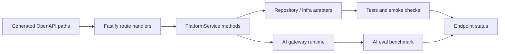

# Endpoint Implementation Audit

Date: `2026-05-08`
Branch audited: `main`
Commit audited: `ac06c44`

## Scope

This audit checks whether the current MentorMe API has complete implementation coverage for:

- AI endpoints
- non-AI product endpoints
- operational/support endpoints that are reachable through the Fastify app
- frontend API clients that call those endpoints
- automated verification commands that prove the contracts still work

The endpoint inventory was extracted from the generated OpenAPI document served by the app at `/docs/json`, then cross-checked against `backend/src/app.ts`, `backend/src/domain/platformService.ts`, `src/context/AppState.jsx`, and the backend/frontend tests.

## Audit Flow

## Verdict

All currently exposed first-party AI and non-AI endpoint handlers are implemented.

The implementation is not release-clean yet because verification found two non-endpoint blockers:

1. `npm audit` reports `18` dependency advisories: `11` high and `7` moderate.
2. `npm run lint` fails with `8` errors and `1` warning.

The endpoint layer itself is functional under tests and local deterministic AI evals.

## Endpoint Inventory Summary

| Category | Count | Status | Notes |
| --- | ---: | --- | --- |
| AI endpoint methods | 3 | Complete | All three call `PlatformService`, route through the AI gateway, and persist `AiRun` records when generation runs. |
| Non-AI OpenAPI endpoint methods | 32 | Complete | Product, integration, SSE, and health routes are registered and backed by service or infra logic. |
| Better Auth wildcard | 1 wildcard | Complete with runtime condition | `/api/auth/*` is delegated to Better Auth when Prisma auth is configured. It is intentionally not listed in the generated OpenAPI paths. |
| Swagger/docs support | 3 support routes | Complete | `/docs/`, `/docs/json`, and `/docs/yaml` are served by Swagger UI/plugin. |
| Global CORS preflight | 1 wildcard | Complete | `OPTIONS *` is present through Fastify/CORS. |

## AI Endpoint Status

| Endpoint | Implementation | Runtime backing | Frontend client | Tests/evals | Status |
| --- | --- | --- | --- | --- | --- |
| `POST /ai/request-brief` | `backend/src/app.ts` -> `generateRequestBrief` | Heuristic or OpenAI gateway, with `AiRun` persistence | `generateAiRequestBrief` in `src/context/AppState.jsx` | `backend/src/app.test.ts`, `src/context/AppState.test.jsx`, AI eval cases | Complete |
| `POST /ai/meeting-summary` | `backend/src/app.ts` -> `generateMeetingSummary` | Heuristic or OpenAI gateway, with `AiRun` persistence | `generateAiMeetingSummary` in `src/context/AppState.jsx` | `backend/src/app.test.ts`, AI eval cases | Complete |
| `POST /ai/mentor-recommendations` | `backend/src/app.ts` -> `generateMentorRecommendations` | Active mentor DB profiles only, then heuristic/OpenAI ranking, with `AiRun` persistence when ranking runs | `generateAiMentorRecommendations` in `src/context/AppState.jsx` | `backend/src/app.test.ts`, `src/context/AppState.test.jsx`, AI eval cases | Complete |

AI boundary note: when there are no active mentor candidates, `POST /ai/mentor-recommendations` returns a safe empty shortlist without calling the AI gateway. That path does not create an `AiRun`, because no AI generation occurs.

## Non-AI Endpoint Status

| Endpoint | Area | Implementation status | Verification notes |
| --- | --- | --- | --- |
| `GET /healthz` | Infra | Complete | Direct backend test and Render health check config. |
| `GET /me` | Auth/session | Complete | Direct backend test and frontend bootstrap tests. |
| `GET /me/onboarding` | Onboarding | Complete | Direct backend tests and frontend onboarding tests. |
| `POST /onboarding/founder` | Onboarding | Complete | Direct backend tests and frontend client tests. |
| `POST /onboarding/student` | Onboarding | Complete | Direct backend tests and frontend client tests. |
| `GET /onboarding/student/options` | Onboarding | Complete | Direct backend tests and frontend client tests. |
| `GET /invitations` | Invitations | Complete | Direct backend tests and CFE frontend tests. |
| `POST /invitations` | Invitations | Complete | Direct backend tests and CFE frontend tests. |
| `GET /invitations/{token}` | Invitations | Complete | Direct backend tests and invitation accept frontend tests. |
| `POST /invitations/{token}/accept` | Invitations | Complete | Direct backend tests and invitation accept frontend tests. |
| `DELETE /invitations/{invitationId}` | Invitations | Complete | Direct backend tests. |
| `GET /ventures` | Ventures | Complete | Direct backend tests and frontend API hydration tests. |
| `GET /ventures/{ventureId}` | Ventures | Complete | Used by frontend API hydration; handler and service are implemented. |
| `GET /ventures/{ventureId}/requests` | Requests | Complete | Direct backend tests and frontend API hydration tests. |
| `POST /ventures/{ventureId}/requests` | Requests | Complete | Direct backend tests and Playwright e2e spec coverage exists. |
| `GET /requests` | Requests | Complete | Direct backend tests and frontend client tests. |
| `POST /requests/{requestId}/submit` | Requests | Complete | Direct backend tests. |
| `POST /requests/{requestId}/return` | Requests | Complete | Direct backend tests and CFE UI tests. |
| `POST /requests/{requestId}/approve` | Requests | Complete | Direct backend tests and notification UI tests. |
| `POST /requests/{requestId}/close` | Requests | Complete | Handler and service are implemented; covered through request lifecycle surfaces. |
| `POST /requests/{requestId}/artifacts/presign` | Artifacts | Complete | Direct backend tests and Playwright e2e spec coverage exists. |
| `POST /requests/{requestId}/artifacts/complete` | Artifacts | Complete | Direct backend tests and Playwright e2e spec coverage exists. |
| `POST /requests/{requestId}/mentor-outreach` | Mentor outreach | Complete | Direct backend tests, frontend client tests, Prisma smoke script. |
| `GET /mentors` | Mentors | Complete | Frontend hydration/e2e helper coverage exists. |
| `POST /mentors` | Mentors | Complete | Handler and service are implemented; Playwright mentor-network spec covers the UI flow. |
| `PATCH /mentors/{mentorId}` | Mentors | Complete | Direct backend test includes PATCH and CORS preflight. |
| `GET /mentor-actions/{token}` | Mentor external action | Complete | Direct backend tests and mentor desk UI tests. |
| `POST /mentor-actions/{token}/respond` | Mentor external action | Complete | Direct backend tests and Prisma smoke script. |
| `POST /mentor-actions/{token}/schedule` | Mentor external action | Complete | Direct backend tests and Prisma smoke script. |
| `POST /mentor-actions/{token}/feedback` | Mentor external action | Complete | Direct backend tests and Prisma smoke script. |
| `POST /webhooks/calendly` | Integrations | Complete | Direct backend tests for HMAC verification, idempotency, and missing production secret. |
| `GET /notifications/stream` | Integrations | Complete | Auth rejection is directly tested; frontend stream parser and polling fallback are tested. |

Coverage note: a few routes are implemented and exercised through frontend/e2e surfaces rather than one dedicated backend assertion per route. The only notable test-depth gap is a positive automated SSE emission test for `/notifications/stream`; the implementation exists and the UI also polls as fallback.

## Auth And Support Routes

| Route | Status | Notes |
| --- | --- | --- |
| `/api/auth/*` | Complete with Prisma auth runtime | Delegated to Better Auth via `toNodeHandler` when `createBetterAuth` is configured. Lifecycle and CORS error paths are tested in `backend/src/app.auth.test.ts`. |
| `/docs/` | Complete | Swagger UI served by `@fastify/swagger-ui`; tested in `backend/src/app.test.ts`. |
| `/docs/json` | Complete | Generated OpenAPI JSON; tested and used for this audit inventory. |
| `/docs/yaml` | Complete | Served by Swagger plugin. |
| `OPTIONS *` | Complete | Global CORS preflight; PATCH preflight is tested. |

Runtime note: Better Auth is enabled in the production-style Prisma runtime. If the API runs in memory mode without Prisma, auth is intentionally disabled and protected endpoints reject through `readAuthUser`.

## Verification Results

| Command | Result | Notes |
| --- | --- | --- |
| `git fetch origin` + branch comparison | Passed | `main` was in sync with `origin/main` at audit start. |
| OpenAPI inventory extraction from `/docs/json` | Passed | Confirmed 35 first-party OpenAPI endpoint methods: 3 AI and 32 non-AI. |
| Fastify route tree extraction | Passed | Confirmed app route registration plus docs and global `OPTIONS *`. |
| `npm test` | Passed | `28` test files, `163` tests passed. |
| `npm run build` | Passed | Vite build succeeded. Existing warning: bundle chunk larger than 500 kB. |
| `npm run eval:ai` | Failed in default env | Current env attempted the OpenAI judge path and timed out in `backend/src/ai/openAiGateway.ts`. |
| `env AI_PROVIDER=heuristic AI_JUDGE_PROVIDER=heuristic npm run eval:ai` | Passed | `6/6` eval cases passed, average score `4.05`. |
| `npm run prisma:generate` | Passed | Regenerated Prisma client from `backend/prisma/schema.prisma`. No tracked file changes. |
| `npx tsc --noEmit` | Passed after Prisma generate | Initial failure was stale Prisma client types; regenerated client resolved it. |
| `npm run lint` | Failed | `8` errors and `1` warning, listed below. |
| `npm audit` | Failed | `18` advisories: `11` high, `7` moderate. |

## Current Non-Endpoint Blockers

### Dependency Audit

`npm audit` reports `18` vulnerabilities:

- `11` high
- `7` moderate

Affected packages include `fastify`, `vite`, `rollup`, `fast-xml-parser`, `effect` via Prisma tooling, `bullmq` via `uuid`, `postcss`, `picomatch`, `flatted`, `defu`, `ajv`, `brace-expansion`, and `@fastify/static`.

Recommended next action: run a dependency upgrade pass with tests after `npm audit fix`, then re-run `npm audit`, `npm test`, `npm run build`, `npm run lint`, `npx tsc --noEmit`, and the AI eval.

### Lint

`npm run lint` currently fails on:

- `src/components/Sidebar.jsx`: unused `motion`, missing hook dependency warning for `onMobileClose`, empty block statement.
- `src/components/TopHeader.jsx`: unused `motion`.
- `src/context/AppState.jsx`: unused `getRoleEmailForPath`.
- `src/pages/auth/GoogleCallbackPage.jsx`: synchronous `setState` inside effect.
- `src/pages/cfe/__tests__/CfePages.test.jsx`: unused `within`.
- `src/pages/founders/__tests__/FounderPages.test.jsx`: unused `within`.
- `src/pages/students/__tests__/StudentPages.test.jsx`: unused `within`.

Recommended next action: fix lint in a narrow cleanup commit, then rerun the full verification set.

### AI Provider Environment

The default AI eval command failed because the current environment selected the OpenAI judge path and timed out. The deterministic local path passes.

This means:

- local endpoint contracts are verified
- heuristic fallback behavior is verified
- production OpenAI behavior still needs a live credential/network verification pass before claiming the OpenAI path is operational in that deployment

## Traceability Task List

| Task | Diagram node | Evidence | Status |
| --- | --- | --- | --- |
| Extract API surface | `Generated OpenAPI paths` | `/docs/json`, Fastify route tree | Complete |
| Match handlers to service methods | `Fastify route handlers` -> `PlatformService methods` | `backend/src/app.ts`, `backend/src/domain/platformService.ts` | Complete |
| Verify persistence/infra backing | `Repository / infra adapters` | Prisma repository, in-memory repository, S3/stub storage, Resend/stub email, queue runtime | Complete |
| Verify AI backing | `AI gateway runtime` | heuristic gateway, OpenAI gateway, AI runtime selector, eval cases | Complete |
| Run verification | `Tests and smoke checks`, `AI eval benchmark` | command results above | Complete with blockers noted |
| Produce status report | `Endpoint status` | this document | Complete |

## Final Status

Endpoint implementation status: complete for the current API surface.

Release cleanliness status: not clean yet, because dependency audit and lint are failing.

Production AI status: endpoint implementation is complete, heuristic evals pass, but the OpenAI-backed path still needs a live successful eval in the target environment.
