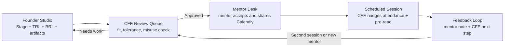

# MentorMe Frontend System

## Flow

## Task Traceability

| Task | UI surface | Notes source |
| --- | --- | --- |
| Founder submits a complete mentor request | `/student` request composer | "need to submit something document or pitch deck or technical spec" |
| CFE narrows and approves mentor access | `/admin` pipeline board | "CFE team has to give the final approval" |
| Mentor shares slot through controlled flow | `/mentor` incoming requests | "calendly links" and "cant allow direct connection" |
| Meeting follow-up stays visible | `/mentor` feedback and `/student` pipeline | "Include feedback after the meeting" |
| Mentor capacity and tolerance are configurable | `/admin/mentors` mentor network | "Tolerance level for each mentor" |
| Readiness scores guide routing | `/playbook` | "TRL and BRL", "TRL 3 -> serious mentoring" |

## Implementation Notes

- The app uses a shared in-memory state container so founder, mentor, and CFE views stay consistent without backend wiring.
- Route tests cover the core lifecycle: founder submission, CFE approval, and mentor scheduling.
- The design system is intentionally warmer and more editorial than the default Vite/Tailwind baseline, while remaining responsive.
