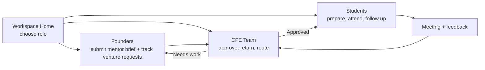

# MentorMe Frontend System

## Flow

## Task Traceability

| Task | UI surface | Notes source |
| --- | --- | --- |
| Founder submits a complete mentor request | `/founders` request composer | "need to submit something document or pitch deck or technical spec" |
| Student handles readiness, prep, and follow-through | `/students` workspace | "Students forget that they have a meeting" and "Nudging system" |
| CFE narrows and approves mentor access | `/cfe` pipeline board | "CFE team has to give the final approval" |
| Mentor capacity and tolerance are configurable | `/cfe/network` mentor network | "Tolerance level for each mentor" |
| Readiness scores guide routing | `/playbook` | "TRL and BRL", "TRL 3 -> serious mentoring" |

## Implementation Notes

- The app uses a shared in-memory state container so founder, mentor, and CFE views stay consistent without backend wiring.
- Route tests cover the role split plus the core lifecycle: founder submission, CFE return flow, and student-side follow-through.
- The frontend now defaults to a role chooser instead of a single overloaded dashboard, which keeps each workspace narrower and easier to scan.
