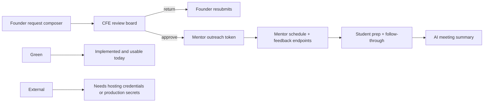

# Mid-Sem Audit

Date: `2026-04-09`

This audit is based on the current codebase and the professor's later AI-review note. Source-of-truth files checked for this audit:

- `src/App.jsx`
- `src/pages/StudentDashboard.jsx`
- `src/pages/StudentWorkspace.jsx`
- `src/pages/AdminDashboard.jsx`
- `src/pages/MentorPortfolio.jsx`
- `src/pages/MentorDashboard.jsx`
- `src/pages/MidsemReadiness.jsx`
- `src/context/AppState.jsx`
- `src/data/midsemReadiness.js`
- `backend/src/app.ts`
- `backend/src/app.test.ts`
- `backend/src/ai/*`
- `backend/src/domain/platformService.ts`
- `backend/evals/cases.ts`
- `backend/scripts/run-ai-evals.ts`
- `backend/scripts/prisma-e2e.ts`
- `backend/prisma/schema.prisma`
- `render.yaml`
- `README.md`
- `docs/midsem-readiness.md`
- `docs/system-architecture.md`
- `docs/code-review-readiness.md`

## Executive Verdict

MentorMe is now mid-sem ready for both the original implementation review and the later AI-focused follow-up.

- The core founder -> CFE -> mentor -> student workflow is implemented.
- The API progress sheet is now fully green for the presentation inventory.
- The two AI endpoints are implemented, surfaced in the UI, and covered by a benchmark runner with sample cases and an LLM-as-judge path.
- Swagger, API tests, browser E2E, Prisma smoke testing, lint, typecheck, and the AI benchmark all pass locally.
- The remaining risk is no longer missing code. The remaining risk is external deployment access and presentation discipline.

## Audit Map

## Most Important Findings

### 1. The presentation endpoint inventory is now fully implemented

The mid-sem readiness data and the current backend contract now match. For the presentation inventory, the backend exposes `28` implemented endpoints, including the two AI routes.

### 2. The AI review requirement is now covered properly

The repo now includes:

- `POST /ai/request-brief`
- `POST /ai/meeting-summary`
- sample benchmark cases in `backend/evals/cases.ts`
- an eval runner in `backend/scripts/run-ai-evals.ts`
- a configurable judge path that can use OpenAI structured outputs or a heuristic fallback

This directly answers the professor's requirement to benchmark AI endpoints and keep a repeatable QoS check when models change.

### 3. The AI layer is demoable in the product, not only on Swagger

The founder workspace now lets users turn rough notes into a mentor-ready brief, and the student workspace now turns messy meeting notes into structured follow-through. This means the AI layer can be shown through a real user journey.

### 4. The deployment story is now concrete enough to present honestly

The API exposes `GET /healthz`, the server respects the platform `PORT`, and the repo includes `render.yaml` for the frontend, API, worker, and PostgreSQL stack. That makes deployment readiness real in the codebase even though actual public deployment still depends on platform credentials.

## Rubric Readiness

| Rubric area | Honest status | What to say in the presentation |
| --- | --- | --- |
| Product pitch clarity | Strong | Lead with the role-based story: founder asks, CFE triages, mentors respond, students close the loop. |
| Product need definition and validation | Medium-strong | The need is clear. Validation is still qualitative, so speak in terms of repeated feedback patterns, not invented user-study counts. |
| Completeness of API endpoints and DB design | Strong | Fastify routes, Swagger, Prisma schema, and runtime selection are real and fully presentable. |
| Implementation progress | Strong | The presentation inventory is fully implemented and the verification stack is broad. |
| Lessons from feedback | Strong | You can now tie product changes to user feedback and tie AI design to operational clarity rather than hype. |

## Corrected Endpoint Progress Sheet

Use this as the real sheet for the presentation.

Color logic:

- `Green`: implemented and can be shown either in UI or in Swagger
- `Yellow`: partially integrated
- `White`: planned only

### Summary Numbers

- Total endpoints to present: `28`
- Green: `28`
- Yellow: `0`
- White: `0`
- Completion: `28 / 28 = 100%`
- Non-AI green: `26 / 26 = 100%`
- AI green: `2 / 2 = 100%`

### Detailed Sheet

| Endpoint | Status | Demo surface | Note |
| --- | --- | --- | --- |
| `POST /auth/magic-link/request` | Green | UI + Swagger | Used by demo role bootstrap |
| `POST /auth/magic-link/verify` | Green | UI + Swagger | Used by demo role bootstrap |
| `POST /auth/refresh` | Green | UI + Swagger | Cookie-based session refresh is implemented |
| `POST /auth/logout` | Green | Swagger | Implemented, but current UI still uses demo bootstrap instead of a visible logout control |
| `GET /me` | Green | Swagger | Implemented, not surfaced in current UI |
| `GET /ventures` | Green | UI + Swagger | Used by app hydration |
| `GET /requests` | Green | UI + Swagger | Used by CFE hydration |
| `GET /ventures/:ventureId` | Green | UI + Swagger | Used by founder and student hydration |
| `GET /ventures/:ventureId/requests` | Green | UI + Swagger | Used by founder and student hydration |
| `POST /ventures/:ventureId/requests` | Green | UI + Swagger | Founder request creation works |
| `POST /requests/:requestId/submit` | Green | UI + Swagger | Founder resubmission works |
| `POST /requests/:requestId/return` | Green | UI + Swagger | CFE return flow works |
| `POST /requests/:requestId/approve` | Green | UI + Swagger | CFE approval flow works |
| `POST /requests/:requestId/close` | Green | UI + Swagger | CFE can close follow-up requests from the board |
| `POST /requests/:requestId/artifacts/presign` | Green | UI + Swagger | Founder upload flow is wired in the tracker |
| `POST /requests/:requestId/artifacts/complete` | Green | UI + Swagger | Founder upload flow is wired in the tracker |
| `GET /mentors` | Green | UI + Swagger | Used by founder and CFE views |
| `POST /mentors` | Green | UI + Swagger | Mentor creation works in Mentor Network |
| `PATCH /mentors/:mentorId` | Green | UI + Swagger | Mentor visibility and capacity updates work |
| `POST /requests/:requestId/mentor-outreach` | Green | UI + Swagger | CFE can create the secure mentor link from the board |
| `GET /mentor-actions/:token` | Green | UI + Swagger | Used by the routed mentor desk |
| `POST /mentor-actions/:token/respond` | Green | UI + Swagger | Routed mentor desk accept/decline flow works |
| `POST /mentor-actions/:token/schedule` | Green | UI + Swagger | Routed mentor desk scheduling works |
| `POST /mentor-actions/:token/feedback` | Green | UI + Swagger | Routed mentor desk feedback works |
| `POST /webhooks/calendly` | Green | Swagger + tests | Implemented and idempotent |
| `GET /notifications/stream` | Green | UI + backend | Frontend consumes live updates with polling fallback |
| `POST /ai/request-brief` | Green | UI + Swagger | Founder AI drafting flow is implemented and benchmarked |
| `POST /ai/meeting-summary` | Green | UI + Swagger | Student AI summary flow is implemented and benchmarked |

## What Is Done

### Demo-ready in the current routed UI

- founder request composition and submission
- founder resubmission of returned briefs
- founder artifact upload to an existing request
- CFE approve, return, outreach, and close actions
- mentor network creation, visibility control, and capacity tuning
- mentor secure desk accept, schedule, and feedback flow
- student prep and follow-through workspace
- founder AI brief drafting
- student AI meeting-summary generation
- Swagger UI and OpenAPI JSON
- browser E2E for founder flow, mentor network, and secure mentor flow

### Backend-complete and safe to show in Swagger

- magic-link auth request, verify, refresh, logout
- current user lookup
- venture detail and venture-scoped request listing
- request close
- artifact presign and completion
- secure mentor outreach token
- secure mentor action detail lookup
- secure mentor accept or decline response
- secure mentor scheduling
- secure mentor feedback
- Calendly webhook handling
- AI brief and AI summary endpoints
- health probe endpoint

### Data layer and verification done

- Prisma schema for the production data model
- runtime selection between seeded memory and Prisma
- live Prisma E2E smoke against PostgreSQL
- backend workflow tests
- frontend route tests
- AI benchmark runner with sample fixtures
- lint and typecheck

## What Is Left

### Still incomplete for product polish

- add a visible logout and explicit sign-in flow instead of relying on demo-role bootstrap
- replace the stub artifact storage URL with real object storage
- keep improving mentor-side live sync so external-token pages also refresh after load
- promote the worker from scaffold to real outbox processing

### Still incomplete for deployment and production launch

- provision public hosting accounts and secrets
- run the Render blueprint or equivalent platform deployment
- run the OpenAI-backed benchmark before choosing the production default AI model

## What You Should And Should Not Claim

### Safe claims

- "The full presentation endpoint inventory is implemented."
- "The two AI endpoints are built and benchmarked."
- "Swagger UI, API tests, browser E2E, Prisma smoke testing, lint, typecheck, and the AI benchmark are already in place."
- "The mentor operation pipeline works from founder intake through CFE review, mentor outreach, scheduling, feedback, follow-through, and AI-assisted summarization."

### Do not claim

- "The public deployment is already live" unless you actually deploy it and have the URL.
- "The OpenAI-backed AI path has been verified in production" unless you run it with real credentials.
- "`300-500` target programs is an official government count."

## Recommended Mid-Sem Demo Scope

1. Founder request composer with AI brief drafting
2. CFE board showing review, approval, and mentor outreach
3. Mentor desk showing secure accept/schedule/feedback
4. Student workspace showing AI meeting-summary output
5. Swagger UI with the AI endpoints visible
6. `/midsem` page showing the all-green progress sheet and benchmark/deployment cards
