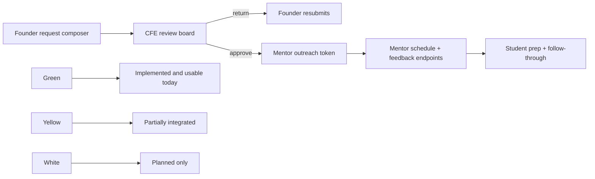

# Mid-Sem Audit

Date: `2026-03-20`

This audit is based on the current codebase, not the older presentation notes. Source-of-truth files checked for this audit:

- `src/App.jsx`
- `src/pages/StudentDashboard.jsx`
- `src/pages/StudentWorkspace.jsx`
- `src/pages/AdminDashboard.jsx`
- `src/pages/MentorPortfolio.jsx`
- `src/pages/MentorDashboard.jsx`
- `src/context/AppState.jsx`
- `src/data/midsemReadiness.js`
- `backend/src/app.ts`
- `backend/src/app.test.ts`
- `backend/scripts/prisma-e2e.ts`
- `backend/prisma/schema.prisma`
- `README.md`
- `docs/midsem-readiness.md`
- `docs/system-architecture.md`
- `docs/code-review-readiness.md`

## Executive Verdict

MentorMe is in a strong mid-sem position if you present it honestly.

- The core founder -> CFE -> mentor operations workflow is implemented.
- The project is above the professor's 70% endpoint threshold even under conservative counting.
- Swagger, API tests, browser E2E, and Prisma smoke testing are already in place.
- The biggest presentation risk is no longer missing core product work. The risk is presenting stale counts or older screenshots.

## Audit Map

## Most Important Findings

### 1. The current progress sheet was undercounting real implemented endpoints, and that gap is now fixed

The mid-sem readiness data now matches the current backend inventory. After the final pass, the backend in `backend/src/app.ts` exposes `26` implemented non-AI routes plus `2` planned AI routes.

The final UI and docs now include the previously missing implemented routes:

- `POST /auth/logout`
- `GET /me`
- `GET /ventures/:ventureId`
- `GET /ventures/:ventureId/requests`
- `POST /requests/:requestId/close`
- `GET /mentor-actions/:token`

This matters because the sheet you present should now use the corrected inventory, not the older count.

### 2. The previously missing product-facing flows are now surfaced in the routed UI

The app now includes:

- real founder-side artifact upload through `presign` and `complete`
- routed mentor desk flow at `/mentors/desk`
- secure mentor-link inspection, accept, schedule, and feedback
- CFE close-request control in the live board
- frontend consumption of live request updates through the notifications stream, with polling fallback

For the presentation, these can now be shown in the actual product, not only in Swagger.

### 3. The mentor self-serve UI is now routed and usable

`src/pages/MentorDashboard.jsx` is now mounted from `src/App.jsx` at `/mentors/desk` and powered by the secure mentor-action backend routes.

### 4. Real-time updates are now product-complete enough to present

`GET /notifications/stream` is now consumed by the frontend, and the browser E2E flow proves founder and CFE views update without manual reload. A polling fallback was added so the product keeps working even if the stream disconnects.

### 5. AI endpoints are still not implemented yet

The AI routes listed on the mid-sem page are roadmap items only:

- `POST /ai/request-brief`
- `POST /ai/meeting-summary`

Do not imply they exist.

### 6. Some older docs are stale

The newest code is ahead of some older docs.

Examples:

- `docs/code-review-readiness.md` still says mentor accept/decline is not implemented.
- `docs/system-architecture.md` still speaks about Prisma as if runtime wiring were still pending.
- `docs/midsem-readiness.md` still lists Prisma runtime as a next step even though runtime selection and Prisma smoke testing already exist.

For this submission, use this audit pack and the current code, not the older doc wording.

## Rubric Readiness

| Rubric area | Honest status | What to say in the presentation |
| --- | --- | --- |
| Product pitch clarity | Strong | Lead with the role-based story: founder asks, CFE triages, mentors respond, students close the loop. |
| Product need definition and validation | Medium-strong | The need is clear. Validation is qualitative, so speak in terms of feedback patterns, not fake interview counts. |
| Completeness of API endpoints and DB design | Strong | Fastify routes, Swagger, Prisma schema, and runtime selection are real. Just present the corrected endpoint list. |
| Implementation progress | Strong | Conservative counting now clears the threshold comfortably. Core non-AI workflow is implemented and tested. |
| Lessons from feedback | Medium-strong | You have clear product learnings, but you must explicitly connect each learning to a product change. |

## Corrected Endpoint Progress Sheet

Use this as the real sheet for the presentation.

Color logic:

- `Green`: implemented and can be shown either in UI or in Swagger
- `Yellow`: partially integrated
- `White`: planned only

### Summary Numbers

- Total endpoints to present: `28`
- Green: `26`
- Yellow: `0`
- White: `2`
- Conservative completion: `26 / 28 = 92.9%`
- Non-AI green: `26 / 26 = 100%`
- Non-AI backend implementation: `26 / 26 = 100%`

### Detailed Sheet

| Endpoint | Status | Demo surface | Note |
| --- | --- | --- | --- |
| `POST /auth/magic-link/request` | Green | UI + Swagger | Used by demo role bootstrap |
| `POST /auth/magic-link/verify` | Green | UI + Swagger | Used by demo role bootstrap |
| `POST /auth/refresh` | Green | UI + Swagger | Cookie-based session refresh is implemented |
| `POST /auth/logout` | Green | Swagger | Implemented, but no visible logout control in current UI |
| `GET /me` | Green | Swagger | Implemented, not surfaced in current UI |
| `GET /ventures` | Green | UI + Swagger | Used by app hydration |
| `GET /requests` | Green | UI + Swagger | Used by CFE hydration |
| `GET /ventures/:ventureId` | Green | UI + Swagger | Used by founder and student hydration |
| `GET /ventures/:ventureId/requests` | Green | UI + Swagger | Used by founder and student hydration |
| `POST /ventures/:ventureId/requests` | Green | UI + Swagger | Founder request creation works |
| `POST /requests/:requestId/submit` | Green | UI + Swagger | Founder resubmission works |
| `POST /requests/:requestId/return` | Green | UI + Swagger | CFE return flow works |
| `POST /requests/:requestId/approve` | Green | UI + Swagger | CFE approval flow works |
| `POST /requests/:requestId/close` | Green | UI + Swagger | CFE can close follow-up requests from the board |
| `POST /requests/:requestId/artifacts/presign` | Green | UI + Swagger | Founder upload flow is wired in the tracker |
| `POST /requests/:requestId/artifacts/complete` | Green | UI + Swagger | Founder upload flow is wired in the tracker |
| `GET /mentors` | Green | UI + Swagger | Used by founder and CFE views |
| `POST /mentors` | Green | UI + Swagger | Mentor creation works in Mentor Network |
| `PATCH /mentors/:mentorId` | Green | UI + Swagger | Mentor visibility and capacity updates work |
| `POST /requests/:requestId/mentor-outreach` | Green | UI + Swagger | CFE can create the secure mentor link from the board |
| `GET /mentor-actions/:token` | Green | UI + Swagger | Used by the routed mentor desk |
| `POST /mentor-actions/:token/respond` | Green | UI + Swagger | Routed mentor desk accept/decline flow works |
| `POST /mentor-actions/:token/schedule` | Green | UI + Swagger | Routed mentor desk scheduling works |
| `POST /mentor-actions/:token/feedback` | Green | UI + Swagger | Routed mentor desk feedback works |
| `POST /webhooks/calendly` | Green | Swagger + tests | Implemented and idempotent |
| `GET /notifications/stream` | Green | UI + backend | Frontend consumes live updates with polling fallback |
| `POST /ai/request-brief` | White | Planned | Not implemented |
| `POST /ai/meeting-summary` | White | Planned | Not implemented |

## What Is Done

### Demo-ready in the current routed UI

- founder request composition and submission
- founder resubmission of returned briefs
- founder artifact upload to an existing request
- CFE approve and return actions
- CFE close request action
- CFE mentor-link generation
- mentor network creation, visibility control, and capacity tuning
- mentor secure desk accept, schedule, and feedback flow
- student prep and follow-through workspace
- Swagger UI and OpenAPI JSON
- browser E2E for founder flow, mentor network, and secure mentor flow

### Backend-complete and safe to show in Swagger

- magic-link auth request, verify, refresh, logout
- current user lookup
- venture detail and venture-scoped request listing
- request close
- artifact presign and completion
- secure mentor outreach token
- secure mentor action detail lookup
- secure mentor accept or decline response
- secure mentor scheduling
- secure mentor feedback
- Calendly webhook handling

### Data layer and verification done

- Prisma schema for the production data model
- runtime selection between seeded memory and Prisma
- live Prisma E2E smoke against PostgreSQL
- backend workflow tests
- frontend route tests

## What Is Left

### Still incomplete for product polish

- add a visible logout and explicit sign-in flow instead of relying on demo-role bootstrap
- replace the stub artifact storage URL with real object storage
- keep improving mentor-side live sync so external-token pages also refresh after load

### Still incomplete for roadmap scope

- AI request-brief endpoint
- AI meeting-summary endpoint
- production auth and explicit sign-in UX instead of demo route-based bootstrap

### Still incomplete for presentation polish

- update the progress sheet you present so it includes all `28` endpoints, not the older `22`
- use Swagger screenshots for backend-complete routes that are not yet in the current UI
- avoid using stale talking points from older docs

## What You Should And Should Not Claim

### Safe claims

- "The core non-AI workflow is implemented."
- "We are above the 70% endpoint threshold."
- "Swagger UI, API tests, browser E2E, and Prisma smoke testing are already in place."
- "The mentor operation pipeline works from founder intake through CFE review, mentor outreach, scheduling, feedback, and close-out."

### Do not claim

- "AI features are already built."
- "Older docs are fully aligned with the latest implementation."

## Recommended Mid-Sem Demo Scope

Keep the live demo tight:

1. `/founders`
2. `/cfe`
3. `/cfe/network`
4. `/students`
5. `http://localhost:3001/docs/`

That gives you the strongest story with the least risk.
