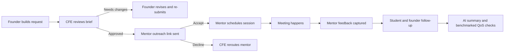
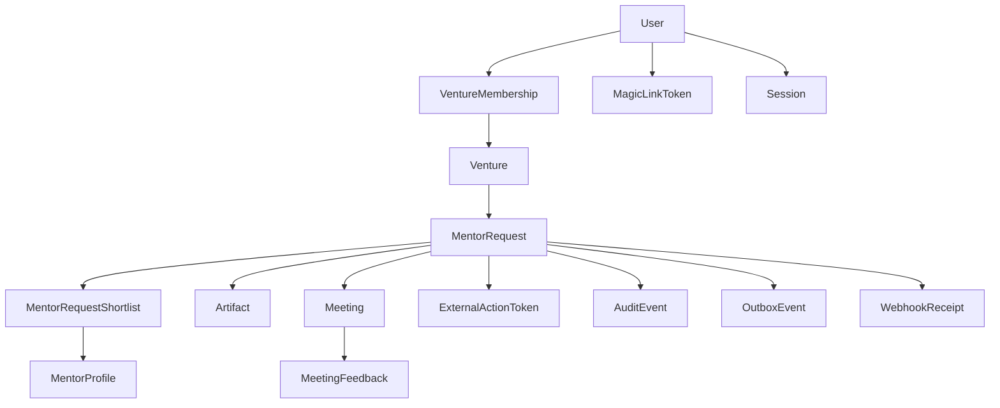

# Mid-Sem Readiness

This document maps the professor's mid-sem expectations to the current MentorMe build, the product scope, the AI review additions, and the honest remaining work.

## 1. What Needed To Exist

### Product

- A clearly named product with a broader market beyond one student cohort
- User journeys that show the product in action instead of only feature lists
- Evidence that feedback changed product decisions

### Engineering

- A defined database design
- A visible API endpoint list
- At least 70% endpoint implementation
- All core non-AI endpoints implemented
- Test coverage for API flows
- AI endpoints with benchmarks and an evaluation path for model changes

## 2. Current Product Position

- Product name: `MentorMe`
- Core users: founders, students supporting ventures, CFE/incubation operators, mentors
- Broader market: incubators, entrepreneurship cells, accelerator programs, innovation offices, and startup support teams
- Commercial wedge: program operations software for mentor routing, capacity control, and follow-through
- Endpoint inventory used for the presentation: `29` total, `29` green, `0` yellow, `0` white
- AI review status: all three AI endpoints are implemented and covered by `6` benchmark cases through `npm run eval:ai`

## 3. System Flow

## 4. Data Model Coverage

## 5. Endpoint And Review Traceability

| Task | Product/engineering intent | Main files |
| --- | --- | --- |
| T1 | Founder intake and request submission | `src/pages/StudentDashboard.jsx`, `backend/src/app.ts`, `backend/src/domain/platformService.ts` |
| T2 | CFE review and return/approve/close | `src/pages/AdminDashboard.jsx`, `src/components/KanbanBoard.jsx`, `backend/src/app.ts` |
| T3 | Founder resubmission of returned briefs | `src/pages/StudentDashboard.jsx`, `src/context/AppState.jsx`, `backend/src/app.ts` |
| T4 | Mentor outreach accept/decline and scheduling | `backend/src/app.ts`, `backend/src/domain/platformService.ts`, `backend/src/app.test.ts` |
| T5 | Artifact handling | `backend/src/app.ts`, `backend/src/domain/platformService.ts` |
| T6 | Mentor directory and capacity tuning | `src/pages/MentorPortfolio.jsx`, `backend/src/app.ts` |
| T7 | AI request-brief endpoint and founder drafting UI | `backend/src/ai/*`, `src/pages/StudentDashboard.jsx`, `backend/evals/cases.ts` |
| T8 | AI mentor-recommendation endpoint and founder shortlist UI | `backend/src/ai/*`, `src/pages/StudentDashboard.jsx`, `backend/evals/cases.ts` |
| T9 | AI meeting-summary endpoint and student follow-through UI | `backend/src/ai/*`, `src/pages/StudentWorkspace.jsx`, `backend/evals/cases.ts` |
| T10 | Deployment and review surface | `src/pages/MidsemReadiness.jsx`, `src/data/midsemReadiness.js`, `render.yaml` |

## 6. Honest Mid-Sem Status

### Now implemented

- founder request submission
- founder resubmission after CFE return
- CFE return, approve, outreach, and close actions
- mentor roster create and update
- routed mentor desk with secure link inspection
- secure mentor accept/decline response endpoint
- mentor scheduling and feedback capture
- artifact presign and complete flow
- founder-side artifact upload UI
- frontend live update consumption with polling fallback
- calendly webhook idempotency
- Swagger UI at `/docs/` and OpenAPI JSON at `/docs/json`
- Prisma schema covering the production data model
- runtime selection between seeded memory and Prisma/PostgreSQL persistence
- backend regression tests for core request, mentor-action, AI, and health-check flows
- AI request-brief, mentor-recommendation, and meeting-summary endpoints
- evaluation benchmarks with sample cases and an LLM-as-judge path
- a tracked Render deployment blueprint and API health probe

### Still after mid-sem

- deploy the public stack with real hosting credentials and secrets
- replace stub upload URLs with real object storage
- replace demo role bootstrap with explicit sign-in and logout UX
- promote the worker from scaffold to real outbox processing
- run the OpenAI-backed benchmark before switching the default AI provider in production

## 7. Feedback Learnings Reflected In The Product

- Mentor access is mediated through CFE because low-context requests waste mentor time.
- Returned briefs are part of the product workflow, not an exception, so founders can now re-submit directly.
- Student work is separated from founder work because prep and follow-through require a different view.
- AI assistance is constrained to mentor ranking, brief drafting, and follow-through summarization so the product improves operator clarity instead of replacing the operator judgment layer.

## 8. Verification

- Full test suite: `npm test`
- Lint: `npm run lint`
- Typecheck: `npx tsc -p tsconfig.json`
- AI benchmark: `npm run eval:ai`
- Browser E2E: `npm run e2e:ui`
- Prisma E2E: `npm run e2e:prisma`
- Swagger UI: `http://localhost:3001/docs/`
- Health probe: `http://localhost:3001/healthz`
- Persistence architecture: `docs/persistence-architecture.md`
