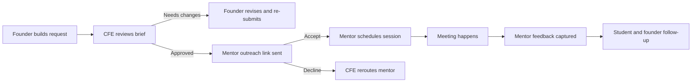
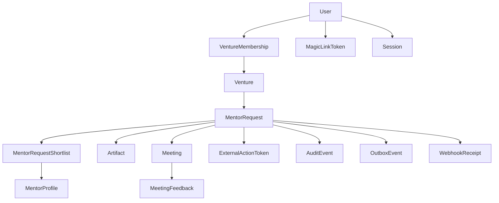

# Mid-Sem Readiness

This document maps the professor's mid-sem expectations to the current MentorMe build, the product scope, and the remaining engineering work.

## 1. What Needed To Exist

### Product

- A clearly named product with a broader market beyond one student cohort
- User journeys that show the product in action instead of only feature lists
- Evidence that feedback changed product decisions

### Engineering

- A defined database design
- A visible API endpoint list
- At least 70% endpoint implementation
- All core non-AI endpoints implemented
- Test coverage for API flows

## 2. Current Product Position

- Product name: `MentorMe`
- Core users: founders, students supporting ventures, CFE/incubation operators, mentors
- Broader market: incubators, entrepreneurship cells, accelerator programs, innovation offices, startup support teams
- Commercial wedge: program operations software for mentor routing, capacity control, and follow-through

## 3. System Flow

## 4. Data Model Coverage

## 5. Endpoint Traceability

| Task | Product/engineering intent | Main files |
| --- | --- | --- |
| T1 | Founder intake and request submission | `src/pages/StudentDashboard.jsx`, `backend/src/app.ts`, `backend/src/domain/platformService.ts` |
| T2 | CFE review and return/approve | `src/pages/AdminDashboard.jsx`, `src/components/KanbanBoard.jsx`, `backend/src/app.ts` |
| T3 | Founder resubmission of returned briefs | `src/pages/StudentDashboard.jsx`, `src/context/AppState.jsx`, `backend/src/app.ts` |
| T4 | Mentor outreach accept/decline and scheduling | `backend/src/app.ts`, `backend/src/domain/platformService.ts`, `backend/src/app.test.ts` |
| T5 | Artifact handling | `backend/src/app.ts`, `backend/src/domain/platformService.ts` |
| T6 | Mentor directory and capacity tuning | `src/pages/MentorPortfolio.jsx`, `backend/src/app.ts` |
| T7 | Mid-sem progress sheet and product review surface | `src/pages/MidsemReadiness.jsx`, `src/data/midsemReadiness.js` |

## 6. Honest Mid-Sem Status

### Now implemented

- founder request submission
- founder resubmission after CFE return
- CFE return and approve actions
- mentor roster create and update
- secure mentor accept/decline response endpoint
- mentor scheduling and feedback capture
- artifact presign and complete flow
- calendly webhook idempotency
- Prisma schema covering the production data model
- backend regression tests for core request and mentor-action flows
- a coded progress sheet for product and endpoint status

### Still after mid-sem

- switch runtime persistence from seeded in-memory state to Prisma/PostgreSQL
- expose Swagger/OpenAPI docs for review-day endpoint testing
- consume SSE in the frontend for live request updates
- add production-grade AI endpoints

## 7. Feedback Learnings Reflected In The Product

- Mentor access is mediated through CFE because low-context requests waste mentor time.
- Returned briefs are part of the product workflow, not an exception, so founders can now re-submit directly.
- Student work is separated from founder work because prep and follow-through require a different view.

## 8. Verification

- Backend tests: `npm test -- backend/src/app.test.ts`
- Frontend tests: `npm test -- src/App.test.jsx src/context/AppState.test.jsx`
