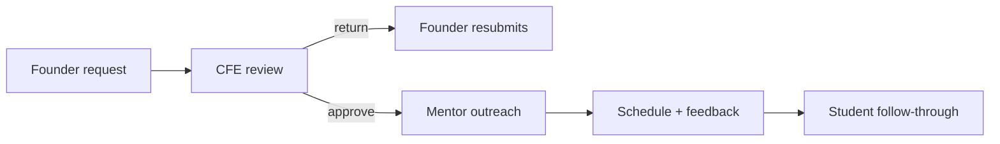

# Mid-Sem Video Scripts And Slide Content

Use this document as the exact speaking pack for the two required videos.

## Video 1

Goal: product pitch  
Target runtime: `2:30` to `3:00`

### Slide 1

Title:

`MentorMe`

Subtitle:

`The operating system for mentor access inside incubators`

On-slide text:

- Founders ask
- CFE triages
- Students prepare
- Mentors respond

Visual:

- Screenshot of `/`
- Or a collage of `/founders`, `/cfe`, and `/cfe/network`

What to say:

"Our product is MentorMe. MentorMe is a mentorship operations platform for incubators, accelerator programs, and innovation offices. Instead of treating mentorship like random introductions over WhatsApp and email, MentorMe turns it into a controlled workflow where founders ask for help, CFE reviews the request, students handle preparation and follow-through, and mentors only receive curated, high-context requests."

### Slide 2

Title:

`Why this product needs to exist`

On-slide text:

- Mentor requests are scattered across spreadsheets, email, and chat
- Founders often ask too early or with weak context
- Mentors receive noisy requests and lose patience
- CFE cannot track approvals, prep, or follow-up cleanly

Visual:

- Screenshot of `/cfe`

What to say:

"The problem we are solving is not just mentor matching. The real problem is mentor operations. Right now, programs manage mentor access through spreadsheets, email threads, forwarded decks, and ad hoc introductions. That creates predictable failures. Founders ask for mentor time too early. Mentors receive low-context requests. CFE loses visibility into what was approved, what was returned, and what happened after the session. MentorMe is the operating layer for that process, not just a directory."

### Slide 3

Title:

`Founder story: Aarav from EcoDrone`

On-slide text:

- Aarav needs help with pilot planning and fundraising framing
- He submits one structured request with venture context and proof
- He sees mentor suggestions, but CFE still controls access
- He can track whether the request is under review, returned, or routed

Visual:

- Screenshot of `/founders`

What to say:

"Let me explain this through one user journey. Aarav is building EcoDrone Systems, and he needs help preparing for pilot conversations and improving how he frames the company for fundraising. In MentorMe, he opens the founder workspace, fills in one structured brief, adds proof like deck references and technical notes, and sends the request to CFE. He can see likely mentor matches, but he cannot directly reach out. That guardrail is important, because the product is designed to protect mentor bandwidth and improve request quality before mentor time is spent."

### Slide 4

Title:

`Operator, student, and mentor story`

On-slide text:

- CFE reviews weak vs strong requests
- CFE approves, returns, and manages mentor capacity
- Students handle prep, meeting hygiene, and follow-through
- Mentors receive one secure, curated brief instead of cold outreach
- The whole pipeline stays visible instead of disappearing after an intro

Visual:

- Screenshot of `/cfe`
- Screenshot of `/students`
- Screenshot of `/mentors/desk`

What to say:

"Now look at the rest of the workflow. CFE becomes the operating layer. They review requests, return weak ones, approve strong ones, and manage mentor capacity. Students get a separate workspace for preparation and follow-through. On the mentor side, Radhika opens one secure link, sees a vetted request from Aarav, shares a slot, and leaves feedback after the meeting. MentorMe is not just about making introductions. It makes sure mentor time is spent well and the learning comes back into the system."

### Slide 5

Title:

`Market, beachhead, and business model`

On-slide text:

- Customers: incubators, entrepreneurship cells, accelerator programs, innovation offices
- Buyer: the program, not the individual founder
- Conservative India beachhead: `300-500` programs
- Why that number: `300` incubators in the Startup India Seed Fund Scheme and `72` Atal Incubation Centres before counting overlap, E-cells, and private accelerators
- Revenue model: cohort-based or annual institutional SaaS
- Wedge TAM: at `INR 2-5 lakh` per program per year, roughly `INR 6-25 crore` annually
- Long-term vision: AI-assisted briefing, meeting summaries, live operations, mentor analytics

Visual:

- Simple market graphic: programs -> founders/students -> mentors
- Or a clean business model slide with beachhead, TAM, and roadmap

What to say:

"Our broader market is not one university cohort. We want to serve incubators, entrepreneurship cells, accelerator programs, and innovation offices. The buyer is the program, not the founder. For a conservative India beachhead, we estimate 300 to 500 target programs. That is grounded in the ecosystem: Startup India's Seed Fund Scheme was designed around 300 incubators, and Atal Innovation Mission reports 72 Atal Incubation Centres, even before counting university cells and private accelerators. At 2 to 5 lakh rupees per program per year, that gives us an initial India wedge of roughly 6 to 25 crore rupees annually. Long term, we expand into AI briefing, meeting summaries, live mentor operations, and program analytics."

Presenter backup note for Slide 5:

- `300 incubators`: Startup India Funding Guide says the Seed Fund Scheme is designed to support an estimated 3,600 entrepreneurs through `300 incubators`
- `72 AICs`: Atal Innovation Mission official impact page reports `72` Atal Incubation Centres
- `INR 6-25 crore TAM`: pitch assumption based on `300-500` programs and `INR 2-5 lakh` annual contract value

## Video 2

Goal: implementation progress  
Target runtime: `4:30` to `5:00`

### Slide 1

Title:

`What is already built`

On-slide text:

- React frontend with role-based workspaces
- Fastify backend with Swagger/OpenAPI
- Prisma schema and PostgreSQL runtime option
- Automated tests for backend, frontend, browser, and Prisma smoke

Visual:

- Screenshot of `/`
- Screenshot of `http://localhost:3001/docs/`

What to say:

"For implementation progress, this is not only a frontend mockup. We have a React frontend with separate workspaces for founders, students, and the CFE team. We also have a Fastify backend, a Swagger UI for endpoint testing, a Prisma schema for the production database model, runtime selection for PostgreSQL, and automated verification across backend tests, frontend tests, browser E2E, and a live Prisma smoke test."

### Slide 2

Title:

`Current workflow that works today`

On-slide text:

1. Founder submits mentor request
2. CFE returns or approves
3. Founder can resubmit if needed
4. Mentor outreach token is created
5. Mentor schedule and feedback endpoints are available
6. Student workspace supports prep and follow-through

Visual:

- Use a simple flow diagram

What to say:

"The current system flow already works through the core non-AI lifecycle. A founder submits a request. CFE can return it or approve it. If it is returned, the founder can resubmit directly. Once approved, the backend can create a secure mentor outreach token, and mentor scheduling and feedback routes are implemented. On the operations side, students have a separate workspace for readiness, preparation, and follow-through."

### Slide 3

Title:

`Endpoint progress sheet`

On-slide text:

- Total endpoints presented: `28`
- Green: `26`
- Yellow: `0`
- White: `2`
- Conservative completion: `92.9%`
- Non-AI green: `100%`

Add this sentence to the slide:

`All core non-AI endpoints are implemented. The remaining white routes are AI features.`

Visual:

- Screenshot of `/midsem`
- Or a recreated table in your slide deck using the corrected audit list

What to say:

"Here is the corrected progress sheet. The backend currently exposes 26 implemented non-AI routes, and for the presentation we are showing 28 endpoints total when we include two planned AI routes. That gives us 26 green and 2 white, which is 92.9 percent completion overall and full completion on the presented non-AI set. The only remaining white items are the AI routes, which we are honestly presenting as planned."

### Slide 4

Title:

`Database design`

On-slide text:

- `Organization`, `Cohort`, `User`
- `Venture`, `VentureMembership`
- `MentorProfile`, `MentorCapacitySnapshot`
- `MentorRequest`, `MentorRequestShortlist`
- `Artifact`, `Meeting`, `MeetingFeedback`
- `Session`, `MagicLinkToken`, `ExternalActionToken`
- `AuditEvent`, `OutboxEvent`, `WebhookReceipt`

Visual:

- Screenshot of the Prisma schema
- Or a simplified ER-style diagram

What to say:

"For the database layer, the current production data model is already defined in Prisma. We model users, ventures, memberships, mentor profiles, mentor capacity snapshots, mentor requests, shortlist rankings, artifacts, meetings, meeting feedback, sessions, magic-link tokens, external action tokens, audit events, outbox events, and webhook receipts. So the schema is already much broader than a class-project dummy table setup. It is designed to support real multi-user program operations."

### Slide 5

Title:

`Testing, Swagger, and lessons from feedback`

On-slide text:

- Swagger UI at `/docs/`
- Backend workflow tests
- Frontend route tests
- Browser E2E for founder and mentor-network flows
- Prisma E2E smoke against PostgreSQL

Add this block to the slide:

`Feedback changed the product in three ways:`

- CFE became the gatekeeper, not a passive admin
- returned briefs became a real product flow
- student work was separated from founder work

What to say:

"We also focused on verification. The API is testable on Swagger UI. The backend has workflow regression tests, the frontend has route tests, the browser layer has end-to-end tests for the founder and mentor-network flows, and Prisma has a live smoke test against PostgreSQL. On the product side, feedback changed the design in three important ways. First, CFE became the gatekeeper because low-context requests waste mentor time. Second, returned requests became a real workflow rather than an edge case, which is why founder resubmission now exists. Third, student work was separated from founder work so preparation and follow-through get their own workspace."

### Slide 6

Title:

`What is still left`

On-slide text:

- Add explicit sign-in and logout UX
- Replace stub artifact storage with real object storage
- Improve mentor-side live refresh after secure-link load
- Add explicit sign-in UX beyond demo bootstrap
- Build the two planned AI endpoints

Add one final line:

`So the non-AI operating core is done. The remaining work is production polish and AI.`

Visual:

- Screenshot of `/midsem`

What to say:

"The remaining work is honest and clear. We now have the non-AI operating core working through the routed product, including artifact upload, secure mentor actions, and live cross-workspace updates. The remaining engineering work is production polish: explicit sign-in and logout, real object storage instead of stub upload URLs, stronger mentor-page refresh behavior after the secure link is already open, and then the two planned AI endpoints. So the right summary is this: the non-AI operating core is done, and the next layer is production hardening and AI."

## Recording Notes

### Best demo order

1. `/founders`
2. `/cfe`
3. `/cfe/network`
4. `/mentors/desk`
5. `/students`
6. `http://localhost:3001/docs/`

### What not to say on camera

- do not say the mentor dashboard is fully live in the routed app
- do not say AI endpoints are already implemented
- do not use the older stale endpoint counts from the existing readiness page without correcting them

### Best way to handle the professor's 70% requirement

Say this clearly:

"Using the corrected endpoint inventory, we are at 92.9 percent overall completion, and all presented non-AI endpoints are implemented. The remaining unfinished items are the planned AI endpoints and the production-polish work around explicit sign-in, logout, and storage."
