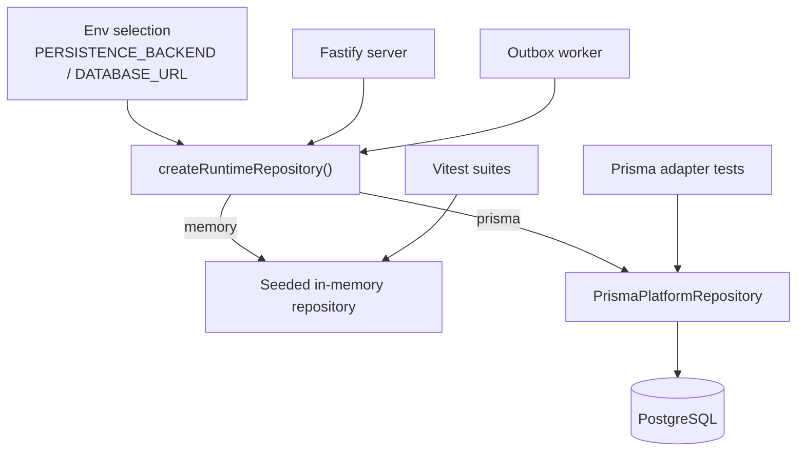

# Persistence Architecture

This document tracks the Prisma persistence rollout for MentorMe and connects the implementation to the runtime entrypoints, tests, and local verification flow.

## Scope

- Replace seeded in-memory persistence with an optional Prisma/PostgreSQL runtime
- Keep the in-memory repository as the zero-setup fallback for frontend-first demos and tests
- Preserve one repository contract across the server, worker, and domain service

## Runtime Flow

## Task Traceability

| Task | Intent | Main files |
| --- | --- | --- |
| P1 | Make the repository contract async so in-memory and Prisma implementations share the same surface | `backend/src/domain/interfaces.ts`, `backend/src/domain/platformService.ts`, `backend/src/infra/inMemoryRepository.ts` |
| P2 | Add a Prisma-backed repository adapter for all persisted entities | `backend/src/infra/prismaRepository.ts`, `backend/prisma/schema.prisma` |
| P3 | Select persistence mode at runtime for the API server and worker | `backend/src/runtime.ts`, `backend/src/server.ts`, `backend/src/worker.ts` |
| P4 | Cover the adapter and runtime selector with tests | `backend/src/infra/prismaRepository.test.ts`, `backend/src/runtime.test.ts`, `backend/src/app.test.ts` |
| P5 | Document how to boot Prisma locally and how the fallback mode behaves | `README.md`, `docs/midsem-readiness.md`, `docs/persistence-architecture.md` |

## Verification

- Typecheck: `npx tsc --noEmit -p /Users/owlxshri/Desktop/MentorMe/tsconfig.json`
- Backend workflow tests: `npm test -- backend/src/runtime.test.ts backend/src/infra/prismaRepository.test.ts backend/src/app.test.ts`
- Repo lint: `npm run lint`
- Prisma client generation: `npm run prisma:generate`
- Live Prisma HTTP smoke: `npm run e2e:prisma`

## E2E Flow

```mermaid
flowchart LR
    A["Reset + seed PostgreSQL"] --> B["createRuntimeRepository() selects Prisma"]
    B --> C["Boot Fastify on an ephemeral localhost port"]
    C --> D["Founder magic-link login"]
    D --> E["Founder creates request"]
    E --> F["CFE approves + creates outreach"]
    F --> G["Mentor accepts, schedules, and submits feedback"]
    G --> H["Verify persisted meeting, feedback, and outbox rows"]
```

## Local DB Smoke Status

- Prisma schema validation passed with `npx prisma validate --schema backend/prisma/schema.prisma`.
- The live Prisma E2E now passes once PostgreSQL is reachable on `localhost:5432`.
- For disposable local verification, a Docker `postgres:16` container on `5432` is sufficient for migrate, seed, and `npm run e2e:prisma`.
