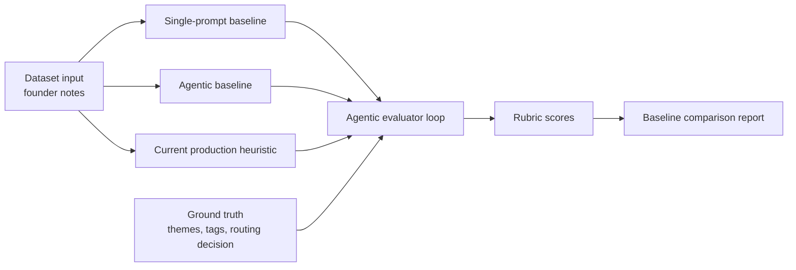

# Request Brief AI Endpoint Showcase Report

Date: `2026-05-08`
Endpoint: `POST /ai/request-brief`

## What Was Added

This report documents the required AI-endpoint showcase for one MentorMe AI endpoint.

The selected endpoint is `POST /ai/request-brief`, because it has a clear user-facing job: turn rough founder notes into a mentor-ready request brief that CFE can route.

The implementation now includes:

- a dataset with inputs and ground truth
- an evaluation implementation with an agentic rubric loop
- a single-prompt baseline
- an agentic baseline
- the current production heuristic implementation as a comparison baseline
- a runnable showcase command

## File Map

| File | Purpose |
| --- | --- |
| `backend/evals/requestBriefShowcaseDataset.ts` | Dataset with `3` request-brief inputs and ground truth labels. |
| `backend/src/ai/requestBriefShowcase.ts` | Baseline implementations, prompt text, agentic plan, evaluator, and report runner. |
| `backend/src/ai/requestBriefShowcase.test.ts` | Regression tests for dataset shape, baselines, evaluator, and full runner. |
| `backend/scripts/run-request-brief-showcase.ts` | CLI runner for the request-brief showcase. |
| `package.json` | Adds `npm run eval:ai:request-brief-showcase`. |

## Evaluation Flow



## 3.1 Dataset With Input And Ground Truth

Dataset file: `backend/evals/requestBriefShowcaseDataset.ts`

The dataset currently has `3` cases:

| Case ID | Input Scenario | Ground Truth Captures |
| --- | --- | --- |
| `rb-001-ecodrone-fundraising` | Industrial-drone MVP founder needs pilot sequencing and fundraising narrative help. | challenge themes, desired outcome themes, mentor tags, readiness signals, no missing info, route decision. |
| `rb-002-healthsathi-procurement` | Digital-health pilot founder needs regulatory sequencing and hospital procurement help. | challenge themes, procurement/regulatory tags, readiness signals, no missing info, route decision. |
| `rb-003-aqualoop-unclear` | Water-treatment prototype founder has missing domain, no artifacts, and unclear desired outcome. | blocker themes, hardware/customer-discovery tags, missing-info labels, clarify-before-route decision. |

Each case has:

- `input`: the actual request body shape for `POST /ai/request-brief`
- `groundTruth.challengeThemes`
- `groundTruth.desiredOutcomeThemes`
- `groundTruth.mentorFitTags`
- `groundTruth.readinessSignals`
- `groundTruth.missingInformation`
- `groundTruth.expectedRoutingDecision`
- `groundTruth.cfeRoutingMustMention`

## 3.2 Evaluation Implementation

Evaluation file: `backend/src/ai/requestBriefShowcase.ts`

The evaluator is an execution-in-loop judge. It does not need a network call, so it is stable in CI and local demos.

The loop scores each baseline output against the ground truth using these rubric stages:

| Rubric Stage | What It Checks |
| --- | --- |
| `schema_contract` | Output has the endpoint fields required by the UI. |
| `challenge_grounding` | Challenge and summary preserve the real founder problem. |
| `outcome_grounding` | Desired outcome matches the session result the founder needs. |
| `mentor_fit_tags` | Tags help CFE pick a mentor without invented categories. |
| `readiness_signals` | TRL, BRL, stage, and artifact context are retained. |
| `missing_information` | Vague requests name missing context instead of pretending they are ready. |
| `cfe_routing_note` | Routing note tells CFE whether to route now or clarify first. |

Passing threshold: `overallScore >= 3.5` and valid schema.

This satisfies the evaluation requirement through an agentic execution loop. It can still be paired with the existing OpenAI judge path in `backend/src/ai/evals.ts` when a live model key is intentionally configured.

## 3.3 Baselines

### Baseline A: Single LLM Prompt

Prompt stored as `singlePromptRequestBriefBaselinePrompt` in `backend/src/ai/requestBriefShowcase.ts`.

It is intentionally simple:

```text
You are a MentorMe assistant. Convert the founder notes into JSON with:
briefSummary, challenge, desiredOutcome, mentorFitTags, readinessSignals,
missingInformation, and cfeRoutingNote.

Rules:
- Preserve the founder's intent.
- Do not invent facts.
- Keep the output concise.
- If context is missing, list it in missingInformation.
```

The local implementation is `runSinglePromptRequestBriefBaseline`. It simulates a basic one-shot prompt baseline by extracting the first useful notes, simple tags, readiness signals, and obvious missing context.

### Baseline B: Agentic Baseline

Plan stored as `agenticRequestBriefBaselinePlan` in `backend/src/ai/requestBriefShowcase.ts`.

The agentic baseline runs a staged loop:

1. Parse venture context: stage, TRL, BRL, domain, artifacts, and stated desired outcome.
2. Extract the real routing challenge from the notes.
3. Infer mentor-fit tags only from supplied context and obvious domain language.
4. Run a gap check for missing outcome, artifacts, domain, and routing decision.
5. Critique the draft against CFE routing needs and revise the routing note.

The local implementation is `runAgenticRequestBriefBaseline`.

### Baseline C: Current Production Heuristic

Implementation: `HeuristicAiGateway.generateRequestBrief`.

This is the current local fallback used when OpenAI is not configured. It is included to compare the two baselines against the current endpoint behavior.

## Actual Showcase Results

Command:

```bash
npm run eval:ai:request-brief-showcase
```

Result:

| Baseline | Cases | Passed | Average Score |
| --- | ---: | ---: | ---: |
| `single_prompt_baseline` | 3 | 3 | 3.96 |
| `agentic_baseline` | 3 | 3 | 4.34 |
| `production_heuristic_current` | 3 | 3 | 4.02 |

The agentic baseline is currently the strongest baseline on this showcase dataset.

## Verification

Commands run:

```bash
npx vitest run backend/src/ai/requestBriefShowcase.test.ts
npm run eval:ai:request-brief-showcase
env AI_PROVIDER=heuristic AI_JUDGE_PROVIDER=heuristic npm run eval:ai
npm run lint
npx tsc --noEmit
npm test
npm run build
```

Results:

- `backend/src/ai/requestBriefShowcase.test.ts`: `4` tests passed.
- `npm run eval:ai:request-brief-showcase`: passed.
- `env AI_PROVIDER=heuristic AI_JUDGE_PROVIDER=heuristic npm run eval:ai`: `6/6` eval cases passed, average score `4.05`.
- `npm run lint`: passed.
- `npx tsc --noEmit`: passed.
- `npm test`: `29` test files passed, `167` tests passed.
- `npm run build`: passed. Vite still reports the existing chunk-size warning for a bundle over `500 kB`.
- Showcase dataset size: `3`.
- Baselines evaluated: `3`.
- Total evaluated outputs: `9`.

## Notes On API Key Handling

No API key is stored in the repository.

This showcase intentionally uses the deterministic local evaluator so it can run without external credentials. If a live OpenAI judge run is needed later, set `OPENAI_API_KEY` in the shell or deployment secret store, not in source files.

## Status

Requirement status:

| Requirement | Status |
| --- | --- |
| `3.1` Dataset with input and ground truth | Complete |
| `3.2` Evaluation implementation | Complete |
| `3.3` Single LLM prompt baseline | Complete |
| `3.3` Agentic baseline | Complete |
| Markdown report | Complete |

The endpoint showcased is `POST /ai/request-brief`.
