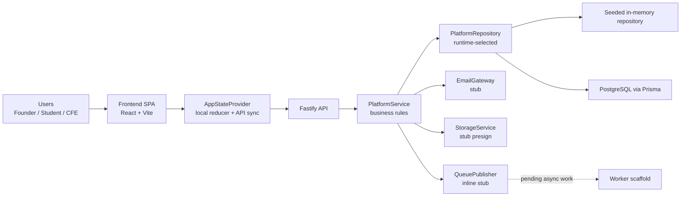
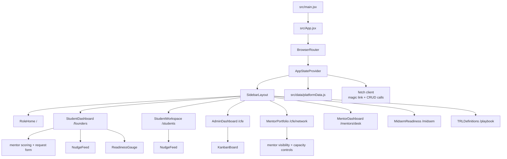
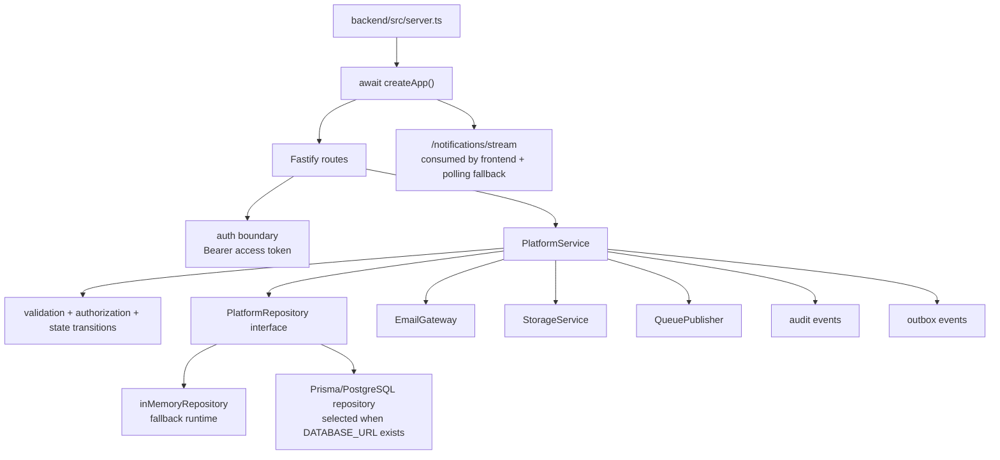
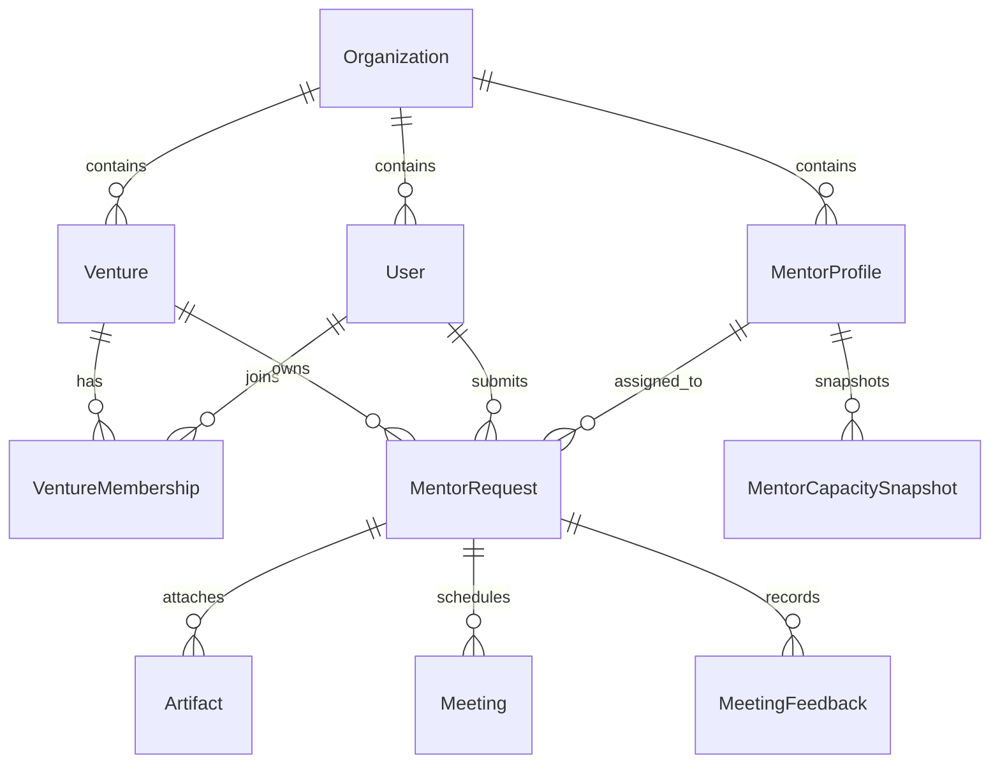
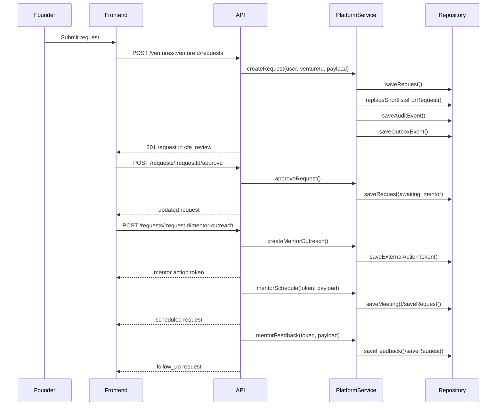

# MentorMe System Architecture

## Purpose

This document describes the current MentorMe frontend and backend architecture as implemented in the repository. It focuses on:

- frontend composition and routing
- backend layers, services, and API boundaries
- the end-to-end mentor request lifecycle
- traceability between product tasks, code surfaces, and diagrams
- current implementation status versus scaffolded infrastructure

## Scope

- Frontend runtime: React 19 + Vite + React Router
- Frontend state: reducer-backed shared state with API hydration, SSE updates, and polling fallback
- Backend runtime: Fastify + domain service + runtime-selected repository
- Data model target: Prisma + PostgreSQL schema with seeded memory fallback
- Async infrastructure: outbox and worker scaffold

## Task List And Traceability

| Task ID | Task | Primary surfaces | Diagram refs | Code refs |
| --- | --- | --- | --- | --- |
| T1 | Role-based workspace selection | Workspace home and sidebar navigation | D1, D2 | `src/App.jsx`, `src/layouts/SidebarLayout.jsx` |
| T2 | Founder submits a mentor request | Founder workspace request composer | D2, D5 | `src/pages/StudentDashboard.jsx`, `src/context/AppState.jsx` |
| T3 | CFE reviews, approves, or returns a request | CFE dashboard and Kanban board | D2, D3, D5 | `src/pages/AdminDashboard.jsx`, `src/components/KanbanBoard.jsx`, `backend/src/app.ts`, `backend/src/domain/platformService.ts` |
| T4 | Students prepare and follow through on sessions | Student workspace and nudge feed | D2, D5 | `src/pages/StudentWorkspace.jsx`, `src/components/NudgeFeed.jsx` |
| T5 | CFE manages mentor capacity and visibility | Mentor network workspace | D2, D3 | `src/pages/MentorPortfolio.jsx`, `backend/src/domain/platformService.ts` |
| T6 | Local auth and API-backed hydration | App state provider and auth endpoints | D2, D3, D5 | `src/context/AppState.jsx`, `backend/src/app.ts` |
| T7 | Artifact upload and completion flow | Backend artifact endpoints | D3, D5 | `backend/src/app.ts`, `backend/src/domain/platformService.ts`, `backend/src/infra/stubStorageService.ts` |
| T8 | Mentor outreach, accept or decline, scheduling, and feedback capture | Mentor action endpoints and request state transitions | D3, D5 | `backend/src/app.ts`, `backend/src/domain/platformService.ts` |
| T9 | Durable persistence and async processing foundation | Prisma schema, runtime selector, and worker scaffold | D3, D4 | `backend/prisma/schema.prisma`, `backend/src/runtime.ts`, `backend/src/worker.ts` |

## Architecture Overview

Diagram ref: `D1`

## Frontend Architecture

### Responsibilities

- Render a role-based single-page application.
- Present separate workspaces for founders, students, and CFE operators.
- Keep a shared platform state in one provider.
- Operate in two modes:
  - `local`: seeded in-memory frontend data only
  - `api`: authenticated sync against the backend when `VITE_API_BASE_URL` is configured

### Frontend Module Diagram

Diagram ref: `D2`

### Route Map

| Route | Page | Role focus | Notes |
| --- | --- | --- | --- |
| `/` | `RoleHome` | entry | Role picker rather than a single mixed dashboard |
| `/founders` | `StudentDashboard` | founders | Request composition, mentor recommendations, request status |
| `/students` | `StudentWorkspace` | students | Prep checklist, readiness context, follow-up actions |
| `/cfe` | `AdminDashboard` | CFE team | Pipeline triage and approval / return actions |
| `/cfe/network` | `MentorPortfolio` | CFE team | Mentor roster, visibility, and capacity |
| `/mentors/desk` | `MentorDashboard` | mentors | Secure mentor inspect/respond/schedule/feedback surface |
| `/midsem` | `MidsemReadiness` | presentation | Product scope, progress sheet, and feedback learnings |
| `/playbook` | `TRLDefinitions` | all roles | Shared readiness reference |

### Frontend State Model

The frontend is centered on `AppStateProvider`:

- `useReducer` stores `venture`, `mentors`, `requests`, and `mode`.
- The reducer supports local mutations for request submission, CFE review, mentor updates, scheduling, and feedback.
- When `VITE_API_BASE_URL` exists, the provider:
  - derives a demo login email from the current route
  - requests a magic link token from the backend
  - verifies the token
  - fetches ventures, requests, and mentors
  - hydrates the reducer with API data
- In API mode, the provider also subscribes to request updates through SSE and falls back to polling if the stream drops.
- If API bootstrapping fails, the UI falls back silently to local seeded state.

### Frontend Design Pattern Summary

- Shared shell: `SidebarLayout`
- Shared business state: `AppStateProvider`
- Page-level workflows: each route owns one role-specific workflow
- Reusable presentation blocks: `SectionCard`, `StatCard`, `Badge`, `ProgressBar`, `NudgeFeed`, `ReadinessGauge`
- No dedicated frontend data-fetching library is used; data access is manual `fetch`

## Backend Architecture

### Responsibilities

- Authenticate users via magic-link flow for local/demo usage.
- Authorize role- and venture-scoped access.
- Enforce request lifecycle rules.
- Manage mentors, artifacts, mentor outreach, scheduling, and feedback.
- Emit audit and outbox records.
- Expose SSE notifications for request updates.

### Backend Layer Diagram

Diagram ref: `D3`

### Backend Components

| Layer | Current implementation | Purpose |
| --- | --- | --- |
| HTTP server | `backend/src/server.ts` | Composes dependencies and starts Fastify |
| App factory | `backend/src/app.ts` | Registers routes, auth guards, SSE stream, validation boundaries |
| Domain service | `backend/src/domain/platformService.ts` | Owns workflow rules and state transitions |
| Runtime selector | `backend/src/runtime.ts` | Chooses Prisma or memory persistence from environment |
| Repository | `backend/src/infra/inMemoryRepository.ts`, `backend/src/infra/prismaRepository.ts` | Stores workflow state in memory or PostgreSQL |
| Email gateway | `backend/src/infra/stubEmailGateway.ts` | Captures sent magic links and mentor outreach in memory |
| Storage service | `backend/src/infra/stubStorageService.ts` | Returns synthetic presigned upload URLs |
| Queue publisher | `backend/src/infra/inlineQueuePublisher.ts` | Captures published async events inline |
| Worker | `backend/src/worker.ts` | Scaffold only; logs pending outbox event count |

### API Surface Summary

| Area | Representative endpoints |
| --- | --- |
| Auth | `POST /auth/magic-link/request`, `POST /auth/magic-link/verify`, `POST /auth/refresh`, `POST /auth/logout`, `GET /me` |
| Venture access | `GET /ventures`, `GET /ventures/:ventureId`, `GET /ventures/:ventureId/requests` |
| Request lifecycle | `POST /ventures/:ventureId/requests`, `POST /requests/:requestId/return`, `POST /requests/:requestId/approve`, `POST /requests/:requestId/close` |
| Artifact handling | `POST /requests/:requestId/artifacts/presign`, `POST /requests/:requestId/artifacts/complete` |
| Mentor operations | `GET /mentors`, `POST /mentors`, `PATCH /mentors/:mentorId`, `POST /requests/:requestId/mentor-outreach` |
| External actions | `GET /mentor-actions/:token`, `POST /mentor-actions/:token/respond`, `POST /mentor-actions/:token/schedule`, `POST /mentor-actions/:token/feedback`, `POST /webhooks/calendly` |
| Notifications | `GET /notifications/stream` |

### Domain Model And Persistence Target

The Prisma schema defines the intended durable model:

- organizations, cohorts, users
- ventures and venture memberships
- mentor profiles and capacity snapshots
- mentor requests and shortlists
- artifacts, meetings, meeting feedback
- sessions, magic links, external action tokens
- notifications, nudges, audit events, outbox events

### Data Storage Diagram

Diagram ref: `D4`

## End-To-End Request Lifecycle

### Workflow Diagram

```mermaid
flowchart LR
    A["Founder opens /founders"] --> B["AppStateProvider loads seeded state or authenticates against API"]
    B --> C["Founder submits mentor request"]
    C --> D["Request enters cfe_review"]
    D --> E["CFE reviews in Kanban board"]
    E -->|Return| F["needs_work"]
    E -->|Approve| G["awaiting_mentor"]
    G --> H["Mentor outreach token created"]
    H --> I["Mentor schedules via action token or Calendly"]
    I --> J["scheduled"]
    J --> K["Mentor feedback captured"]
    K --> L["follow_up"]
    L --> M["CFE decides next action or closes loop"]
```

Diagram ref: `D5`

### Sequence Diagram

## Current Runtime Modes

### Frontend-only demo mode

- `npm run dev`
- Uses seeded state from `src/data/platformData.js`
- No backend dependency required

### Full local demo mode

- `npm run dev:full`
- Starts:
  - Vite frontend
  - Fastify API on port `3001`
  - worker scaffold
- Sets:
  - `VITE_API_BASE_URL=http://localhost:3001`
  - `EXPOSE_DEBUG_TOKENS=true`

## Implemented Versus Scaffolded

| Capability | Status | Notes |
| --- | --- | --- |
| Role-based frontend workspaces | Implemented | Routed pages and shared shell are active |
| Shared frontend state with API fallback | Implemented | API mode depends on `VITE_API_BASE_URL` |
| Magic-link local auth flow | Implemented | Debug token is exposed only when configured |
| Request submission / return / approval | Implemented | Covered by frontend and backend tests |
| Mentor roster create / update | Implemented | Frontend can create and patch mentors |
| Artifact presign / complete flow | Implemented | Storage is stubbed, but endpoint flow exists |
| Mentor outreach / respond / schedule / feedback | Implemented | Secure mentor desk is routed and browser tested |
| SSE request update stream | Implemented | Backend endpoint exists and frontend consumes it with polling fallback |
| Prisma persistence | Implemented | Runtime selects Prisma when `DATABASE_URL` is present; live smoke test exists |
| Background worker processing | Scaffolded | Worker only logs pending outbox events |
| Real email and object storage | Scaffolded | Stubs are wired in current runtime |

## Risks And Architectural Gaps

- Environments without `DATABASE_URL` still run ephemerally in memory.
- The frontend uses route-derived demo identities rather than a user-driven auth session.
- The worker does not yet process outbox events, which limits real asynchronous behavior.
- Artifact storage still uses stub presigned URLs rather than a real object-store backend.
- The mentor desk can still be hardened further for already-open secure-link pages after external events.

## Recommended Next Architecture Steps

1. Move from route-based demo auth to explicit session-aware sign-in and logout UX.
2. Replace stub email, storage, and queue adapters with real infrastructure behind the existing interfaces.
3. Harden mentor-desk live refresh for already-open secure-link pages after external events.
4. Promote the worker from scaffold to real outbox processing.
5. Deploy the existing AI brief-generation and meeting-summary layers with the OpenAI-backed benchmark path turned on before model changes.

## Source Map

- Frontend entry: `src/main.jsx`, `src/App.jsx`
- Frontend state: `src/context/AppState.jsx`
- Frontend pages: `src/pages/*.jsx`
- Frontend data seed: `src/data/platformData.js`
- Backend app factory: `backend/src/app.ts`
- Backend service: `backend/src/domain/platformService.ts`
- Backend repositories: `backend/src/infra/inMemoryRepository.ts`, `backend/src/infra/prismaRepository.ts`
- Backend runtime wiring: `backend/src/runtime.ts`, `backend/src/server.ts`
- Backend worker scaffold: `backend/src/worker.ts`
- Persistence target: `backend/prisma/schema.prisma`
- Validation coverage: `src/App.test.jsx`, `backend/src/app.test.ts`
