# MentorMe Features

MentorMe is a mentorship operations platform for incubators, entrepreneurship cells, and innovation programs. It turns mentor access into a controlled workflow: founders submit clear requests, CFE reviews and routes them, mentors respond from secure links, and students keep the prep and follow-up work moving.

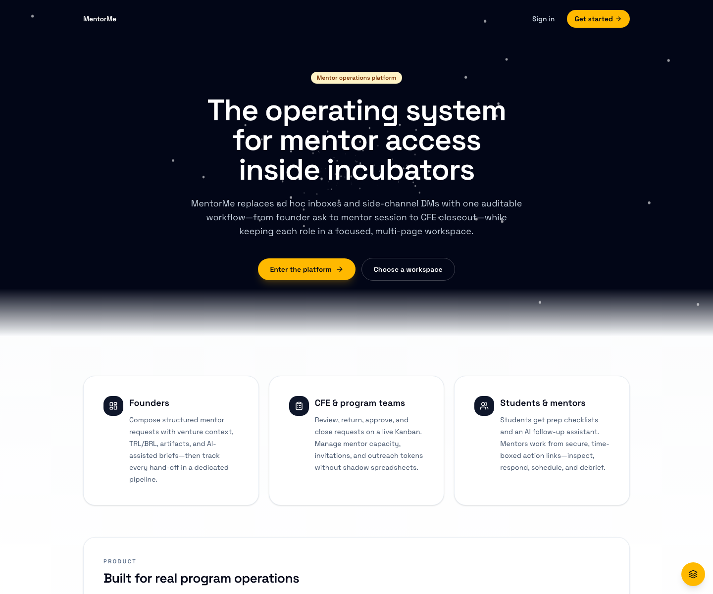

## Product Map

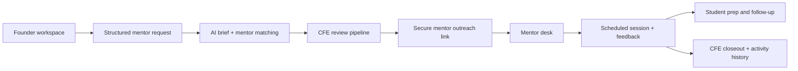

## Role Workspaces

The home screen separates the product by job, not by one giant dashboard. Founders, students, mentors, and the CFE team each get a focused entry point.

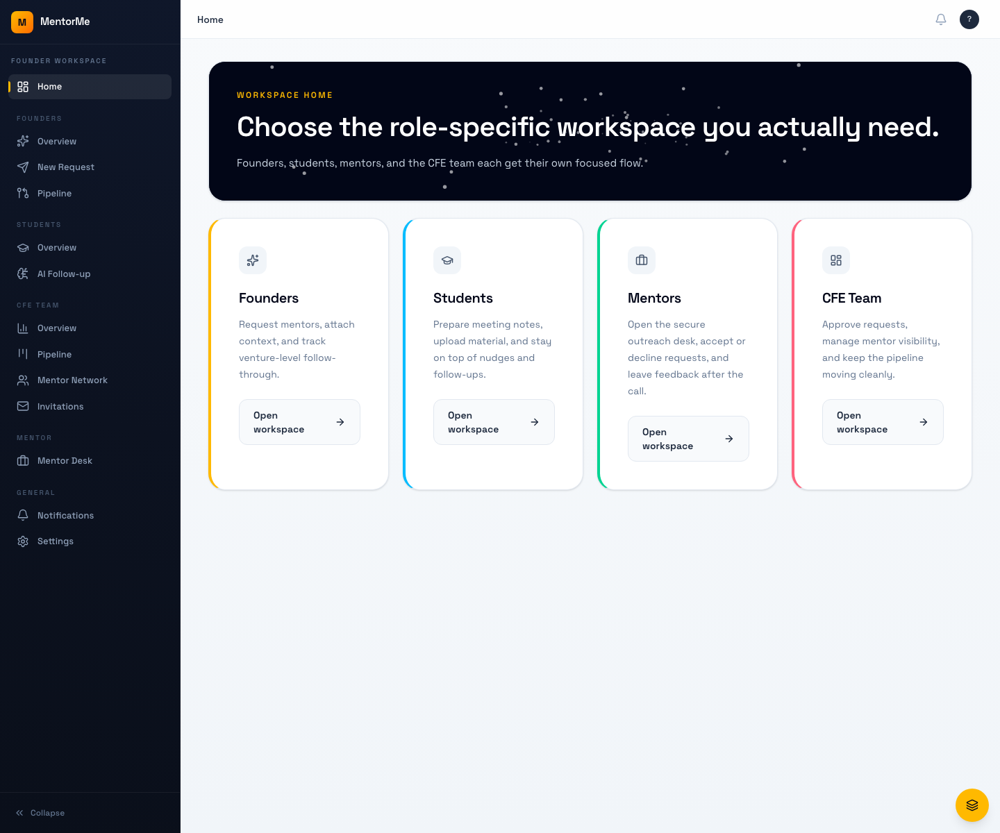

### Founder Workspace

Founders can see the current venture, readiness signals, active requests, and the fastest next action. The workspace is built around the question: "What does CFE need from us before this gets routed?"

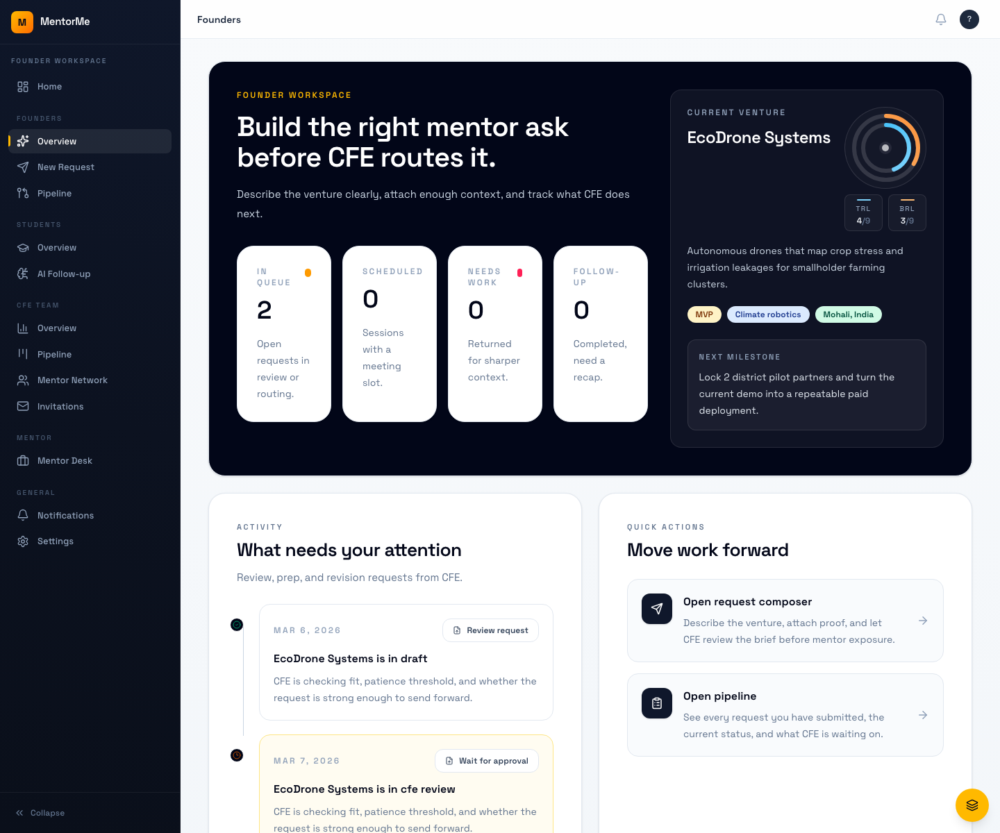

Key founder features:

- Venture context with TRL and BRL readiness signals.
- Request status cards for CFE review, scheduled sessions, returned work, and follow-up.
- Activity timeline for submitted and returned requests.
- Quick actions into the request composer and pipeline.
- Local demo data for fast review without a backend.

### Request Composer

The request composer helps a founder turn a messy ask into a clean brief CFE can actually route. It supports artifacts, desired outcomes, AI-assisted brief writing, and mentor recommendations.

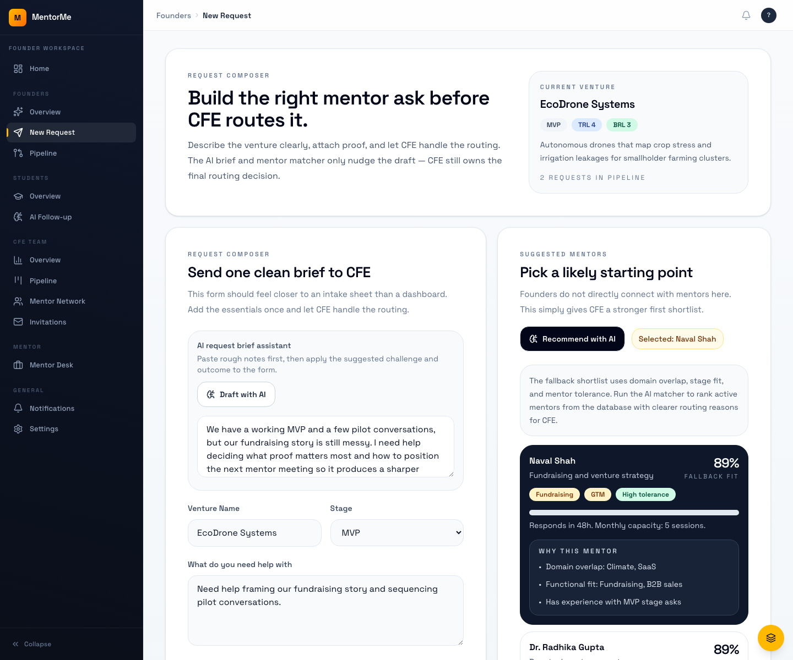

Key request features:

- Structured intake for stage, TRL, BRL, challenge, desired outcome, and proof.
- Artifact list for pitch decks, pilot notes, specs, or other support material.
- AI request brief assistant that transforms raw notes into a sharper challenge and outcome.
- AI mentor matcher with fallback recommendations when OpenAI is unavailable.
- Submission into `cfe_review` so CFE owns the routing decision.

### CFE Pipeline

CFE gets the operational board. Requests move from review to needs-work, awaiting mentor, scheduled, follow-up, and closeout.

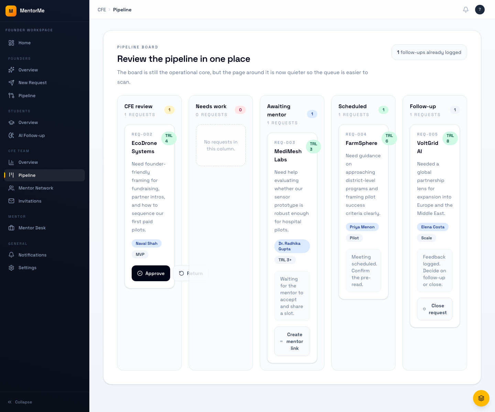

Key CFE features:

- Kanban-style board organized by request status.
- Approve, return, create mentor link, and close actions.
- Mentor assignment visibility on request cards.
- Follow-up count and status badges for fast scanning.
- Secure mentor outreach token generation from approved requests.

### Mentor Network

The mentor network gives CFE a roster view for visibility, capacity, fit, and contact details.

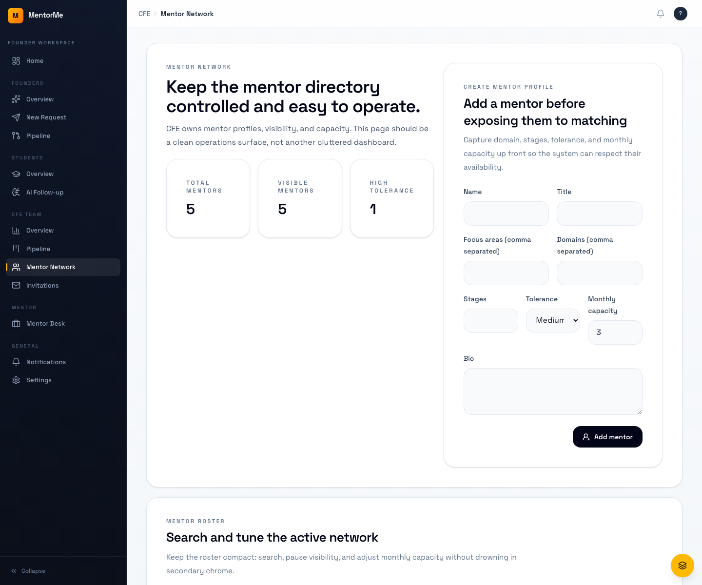

Key mentor network features:

- Mentor profiles with domains, focus areas, stages, response windows, and capacity.
- Active/paused visibility controls.
- Monthly load limits for routing discipline.
- Roster cards optimized for scanning and comparison.
- Source data for mentor recommendations.

### Student Follow-Up

Students get a preparation and follow-through surface, including meeting summary support.

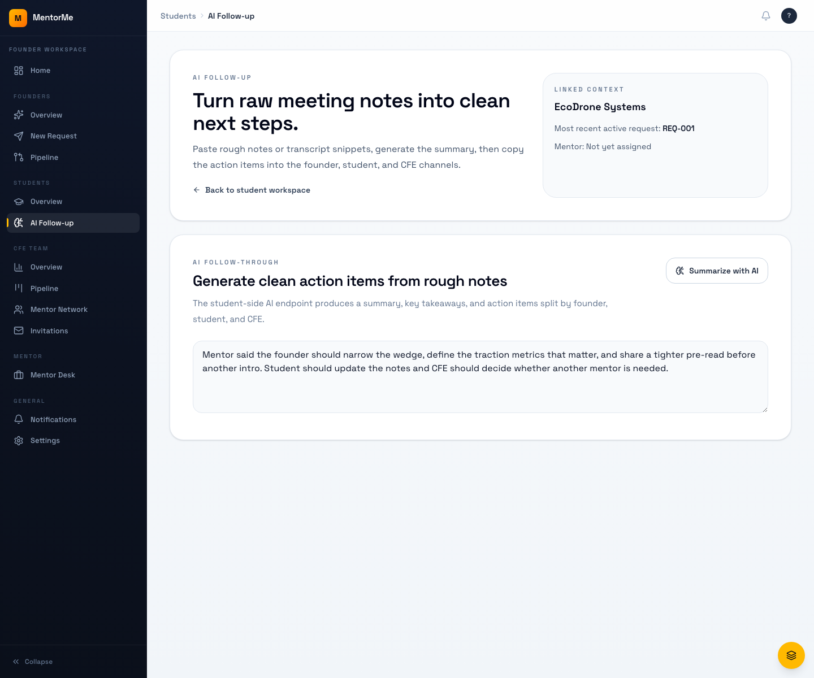

Key student features:

- Meeting prep checklist and venture context.
- Follow-up workflow for turning mentor notes into next steps.
- AI meeting summary support.
- Shared visibility into scheduled and completed mentor requests.
- Prep-focused workspace separate from founder and CFE operations.

### Mentor Desk

Mentors do not need a full internal account flow to respond. The mentor desk is built for secure, time-boxed action links.

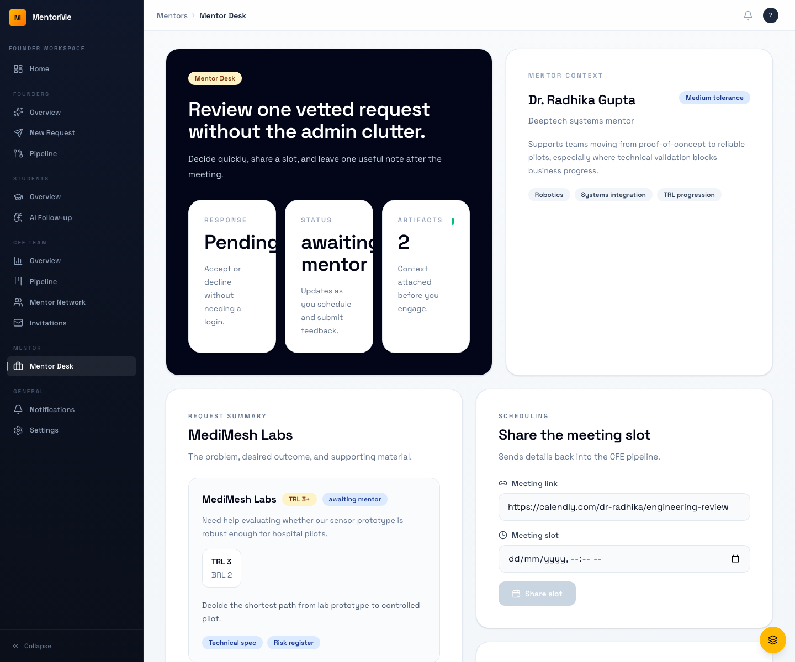

Key mentor features:

- Token-backed request view.
- Accept or decline a mentor request.
- Schedule with a Calendly or manual meeting link.
- Submit post-meeting feedback.
- Keep external mentors out of internal CFE dashboards.

### Auth, Onboarding, And Invitations

MentorMe supports production auth flows while still keeping local demos easy.

Key access features:

- Email/password sign-up and login through Better Auth.
- Magic-link authentication.
- Google OAuth support when credentials are configured.
- Founder and student onboarding wizards.
- CFE-issued invitations for staff, students, founders, and mentors.
- Cookie-backed sessions for hosted frontend and API deployments.

## Feature Inventory

| Area | What Exists |
| --- | --- |
| Public site | `/welcome` landing page with product positioning and CTA routes. |
| Navigation | Persistent role-aware sidebar, breadcrumbs, notification entry, settings menu, and local demo navigator. |
| Founder workflow | Venture overview, request composer, AI brief assistant, mentor recommendations, artifact references, and pipeline tracking. |
| CFE workflow | Overview dashboard, request pipeline board, mentor network, invitations, approval/return/outreach/close actions. |
| Student workflow | Prep workspace, meeting follow-up, AI summary support, and request context. |
| Mentor workflow | Secure action desk for respond, schedule, and feedback flows. |
| AI layer | Request brief generation, mentor recommendation ranking, meeting summary generation, OpenAI gateway, and heuristic fallback. |
| Notifications | In-app notification state, stream endpoint, polling fallback, and activity events. |
| Persistence | Prisma schema for organizations, cohorts, users, ventures, requests, mentors, artifacts, meetings, feedback, audit events, outbox events, AI runs, and invitations. |
| Infrastructure | Fastify API, Swagger docs, Render blueprint, Redis/BullMQ worker path, Resend email gateway, S3/R2 artifact storage, Sentry hooks, and Vercel frontend config. |
| Security | Better Auth sessions, Argon2 password hashing through Better Auth, credentialed CORS, rate limits, Helmet headers, token-hashed external actions, and Calendly webhook signature verification. |
| Testing | Vitest unit/integration coverage, Playwright E2E setup, Prisma smoke tests, and AI eval runner. |

## Core User Journeys

### Founder Request Journey

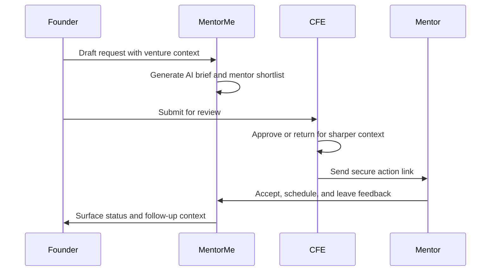

### CFE Operations Journey

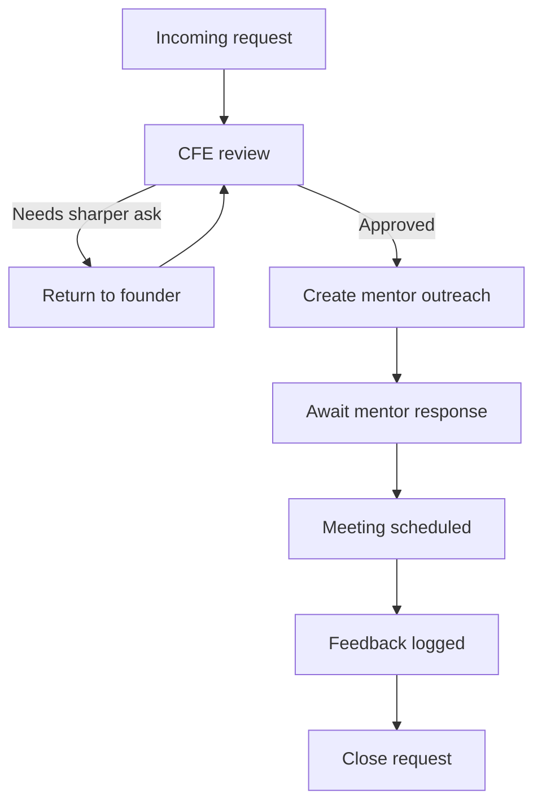

## Verification Snapshot

These screenshots were captured from local demo mode on `http://127.0.0.1:5173` at a `1440x1200` viewport. Current local verification after dependency install:

- `npm test` passes: 28 test files, 163 tests.
- `npm run build` passes.
- `npm audit --audit-level=moderate` currently reports 18 known dependency advisories.

